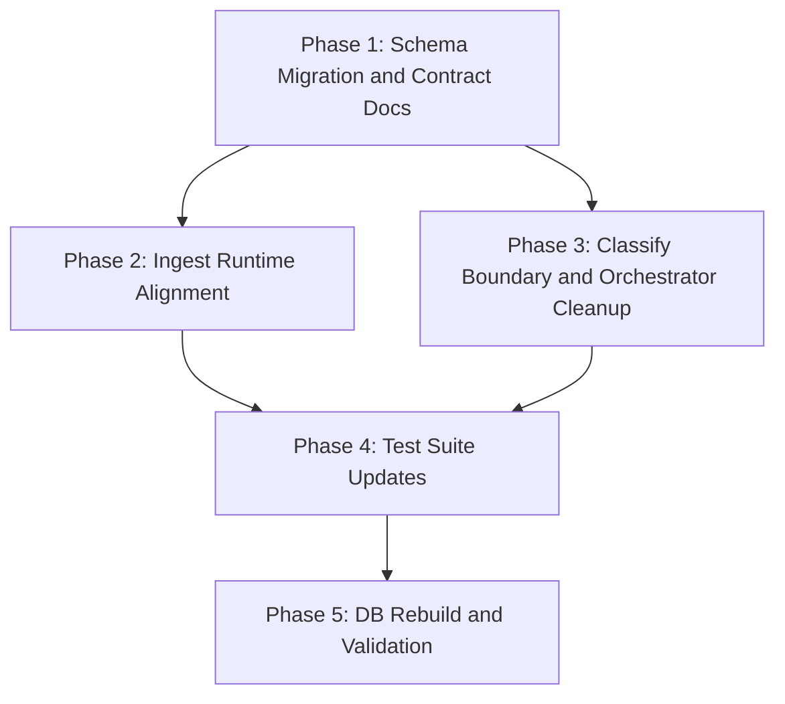

# Refactoring Plan: Text-Processing Status Contract and Classification Boundary Cleanup (V2)

This document defines the prioritized action plan for implementing the V2 text-processing status contract and classification boundary cleanup. It details the specific code locations to be modified and their sequence.

Implementation guardrails for this plan:

- low-context items must remain persisted in canonical ingest storage
- items with `text_processing_status` of `low_context` or `failed` must not produce `classification_result` rows
- sanitization failures must be recorded as `text_processing_status = 'failed'`, not as `low_context`
- `classify_item` must preserve `dry_run` semantics: under `dry_run = True`, the LLM execution path still runs, result accounting remains correct, and no committed `classification_result` rows are left behind
- this refactor replaces `is_low_context` / `low_context_reason` with `text_processing_status` / `text_processing_reason` across schema, runtime, tests, and documentation

---

## 1. Action Plan Overview

The refactoring is divided into five sequential phases. Phase 2 and Phase 3 may proceed in parallel once Phase 1 is complete.



---

## 2. Detailed Phase Breakdown

### Phase 1: Schema Migration and Contract Documentation
* **Priority**: High (Blocker for all subsequent phases)
* **Actions**:
  1. **Migration file** (`modules/ingest/src/migrations/v002_text_processing_status.sql`):
     * Add `text_processing_status TEXT NOT NULL CHECK (text_processing_status IN ('completed', 'low_context', 'failed'))` to `source_item_text`.
     * Add `text_processing_reason TEXT` to `source_item_text` with appropriate CHECK constraint covering both `low_context` and `failed` reason families.
     * Remove `is_low_context` and `low_context_reason` columns.
     * Note: since the database will be rebuilt from scratch in Phase 5, the migration may use a destructive `DROP TABLE` / `CREATE TABLE` approach if that simplifies implementation.
  2. **Documentation verification**: Confirm that all technical docs updated in the prior documentation pass are consistent with V2 contract (this should already be complete).
* **Rationale**: The schema contract must be locked before any runtime code is modified.

### Phase 2: Ingest Runtime Alignment
* **Priority**: High (Ingest must write the new fields before classify can consume them)
* **Target Files**:
  - `modules/ingest/src/sanitizer.py`
  - `modules/ingest/src/orchestrator.py`
  - `modules/ingest/src/database.py`
* **Actions**:
  1. **`sanitizer.py`**:
     * Replace all `is_low_context` / `low_context_reason` return keys with `text_processing_status` / `text_processing_reason`.
     * The `missing_body` early-return path should return `text_processing_status = 'failed'` and `text_processing_reason = 'missing_body'`.
     * All low-context detection paths should return `text_processing_status = 'low_context'` with their existing reason codes.
     * The success path should return `text_processing_status = 'completed'`.
  2. **`orchestrator.py`**:
     * Update the `san_err` exception handler (currently at lines 312-329) to write `text_processing_status = 'failed'` and `text_processing_reason = 'sanitizer_exception'` instead of `is_low_context = 1` / `low_context_reason = 'post_cleanup_empty'`.
     * Update the low-context counter increment to use `text_processing_status` checks.
  3. **`database.py`**:
     * Update INSERT SQL column names from `is_low_context` / `low_context_reason` to `text_processing_status` / `text_processing_reason`.
* **Rationale**: Aligns ingest output with the new three-state contract so classify can consume it.

### Phase 3: Classify Boundary and Orchestrator Cleanup
* **Priority**: High (Module boundary cleanup)
* **Target Files**:
  - `modules/classify/src/database.py`
  - `modules/classify/src/orchestrator.py`
  - `modules/classify/src/config.py`
  - `modules/classify/config/model_settings.yaml`
* **Actions**:
  1. **`database.py`** — `ClassificationResultRepository.get_pending_items`:
     * Update the pending items SQL query to filter on `text_processing_status = 'completed'`:
       ```sql
       SELECT
           s.source_item_id,
           s.title,
           t.sanitized_text
       FROM source_item s
       JOIN source_item_text t ON s.source_item_id = t.source_item_id
       LEFT JOIN classification_result c ON s.source_item_id = c.source_item_id
       WHERE s.ingest_status = 'ingested'
         AND t.text_processing_status = 'completed'
         AND c.classification_result_id IS NULL
       LIMIT ?;
       ```
  2. **`orchestrator.py`** — `classify_item`:
     * Remove the arguments `is_low_context: bool` and `low_context_reason: Optional[str]`.
     * Remove the entire deterministic bypass branch (`if is_low_context: ...`).
     * Ensure the method only handles LLM invocation and standard schema parsing.
     * Preserve the `commit: bool` parameter and dry-run transaction semantics.
  3. **`orchestrator.py`** — `orchestrate_run`:
     * Remove the calculation of `has_non_bypass` and conditional API-key enforcement. Since all pending items now have `text_processing_status = 'completed'`, API credentials are unconditionally required if the pending queue is non-empty.
     * Remove the parameters `is_low_context=...` and `low_context_reason=...` when calling `classify_item`.
  4. **`orchestrator.py`** — `_print_preview_items`:
     * Remove code displaying `is_low_context` and deterministic bypass routes.
  5. **Config cleanup** (`config.py` and `model_settings.yaml`):
     * Remove the `DeterministicClassification` Pydantic model class from `config.py`.
     * Remove `deterministic_classification` from the `ModelSettingsYaml` schema.
     * Remove `self.deterministic` assignment from `ClassifyConfig.__init__`.
     * Remove the `deterministic_classification` block from `model_settings.yaml`.
* **Rationale**: Eliminates all bypass code and dead config paths in the classify module.

### Phase 4: Test Suite Updates
* **Priority**: Medium (Testing alignment)
* **Target Files**:
  - `modules/ingest/tests/test_sanitizer.py`
  - `modules/ingest/tests/test_integration.py`
  - `modules/classify/tests/test_classify.py`
* **Actions**:
  * **Ingest tests**:
    - Update all assertions from `is_low_context` to `text_processing_status`.
    - Add test cases for `text_processing_status = 'failed'` with `text_processing_reason = 'sanitizer_exception'`.
    - Add test case for `missing_body` producing `text_processing_status = 'failed'`.
  * **Classify tests**:
    - Remove all tests verifying the deterministic bypass route and dummy classification records.
    - Adjust mock configurations to remove `deterministic_classification` entries.
    - Update test DDL schemas to use `text_processing_status` / `text_processing_reason` instead of `is_low_context` / `low_context_reason`.
    - Add/update integration tests to assert that items with `text_processing_status = 'low_context'` or `'failed'` are not fetched or processed by `orchestrate_run`.
    - Verify that the existing dry-run test (`test_orchestrate_dry_run_not_committed`) continues to pass: LLM is invoked, `processed_successfully` count is accurate, and `classification_result` table gains no committed rows.
    - Keep failure isolation, retry, and concurrency coverage intact.
* **Rationale**: Ensures test coverage is synchronous with the new three-state contract and simplified orchestrator.

### Phase 5: DB Rebuild and Validation
* **Priority**: Medium (Operational correctness)
* **Actions**:
  1. Delete `data/canonical.db`.
  2. Re-run migrations for `ingest` and `classify` modules:
     ```bash
     python -m modules.ingest.src.cli migrate
     python -m modules.classify.src.cli migrate
     ```
  3. Run the pipeline on the test feeds:
     * Ingest items.
     * Run classify.
  4. Execute validation queries:
     * Status population check:
       ```sql
       SELECT text_processing_status, COUNT(*)
       FROM source_item_text
       GROUP BY text_processing_status;
       ```
     * No downstream classify rows for excluded statuses:
       ```sql
       SELECT COUNT(*)
       FROM source_item_text t
       JOIN classification_result c ON c.source_item_id = t.source_item_id
       WHERE t.text_processing_status IN ('low_context', 'failed');
       ```
       Expected result: `0`.
     * Failure reason visibility:
       ```sql
       SELECT text_processing_reason, COUNT(*)
       FROM source_item_text
       WHERE text_processing_status = 'failed'
       GROUP BY text_processing_reason;
       ```
     * Dry-run safety: Under `dry_run = True`, LLM execution path still runs, result accounting remains correct, and no committed `classification_result` rows are left behind.
* **Rationale**: Full validation of the pipeline's operational boundaries on a clean state.
