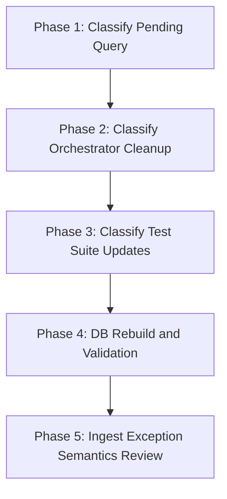

# Refactoring Plan: Low-Context and Classification Boundary Cleanup (V2)

This document defines the prioritized action plan for implementing the V2 low-context boundary cleanup in the codebase. It details the specific code locations to be modified and their sequence.

Implementation guardrails for this plan:

- low-context items must remain persisted in canonical ingest storage
- low-context items must not produce `classification_result` rows
- sanitization failures must not be silently re-labeled as low-context
- this refactor should focus first on the `classify` boundary cleanup, not on expanding ingest persistence semantics beyond what is required

---

## 1. Action Plan Overview

The refactoring is divided into five sequential phases. The mainline work starts with the `classify` queue boundary and runner cleanup, then updates tests and validates behavior on a rebuilt database. Review of ingest sanitization-exception handling is kept as a follow-up confirmation step rather than a mainline blocker.



---

## 2. Detailed Phase Breakdown

### Phase 1: Classify Pending Queue Query Modification
* **Priority**: High (Blocker for routing correctness)
* **Target File**: `modules/classify/src/database.py`
* **Affected Symbol**: `ClassificationResultRepository.get_pending_items`
* **Action**:
  Update the pending items SQL query to actively filter out low-context items using the ingest-populated flag:
  ```sql
  SELECT 
      s.source_item_id, 
      s.title, 
      t.sanitized_text
  FROM source_item s
  JOIN source_item_text t ON s.source_item_id = t.source_item_id
  LEFT JOIN classification_result c ON s.source_item_id = c.source_item_id
  WHERE s.ingest_status = 'ingested'
    AND t.is_low_context = 0
    AND c.classification_result_id IS NULL
  LIMIT ?;
  ```
* **Rationale**: Moving the exclusion to the SQL layer guarantees that items where `is_low_context = 1` are never queried or loaded by the classify runner.

### Phase 2: Classify Orchestrator Code Simplification
* **Priority**: High (Module boundary cleanup)
* **Target File**: `modules/classify/src/orchestrator.py`
* **Affected Symbols**: `classify_item`, `orchestrate_run`, `_print_preview_items`
* **Actions**:
  1. **`classify_item`**:
     * Remove the arguments `is_low_context: bool` and `low_context_reason: Optional[str]`.
     * Remove the entire deterministic bypass branch (`if is_low_context: ...`).
     * Ensure the method only handles LLM invocation and standard schema parsing.
  2. **`orchestrate_run`**:
     * Remove the calculation of `has_non_bypass` and standard environment checks (since all pending items are now guaranteed to have sufficient context, OpenAI/LLM API credentials are unconditionally required if the pending queue is non-empty).
     * Remove the parameters `is_low_context=bool(item["is_low_context"])` and `low_context_reason=item["low_context_reason"]` when calling `classify_item`.
  3. **`_print_preview_items`**:
     * Remove code displaying deterministic bypass routes.
* **Rationale**: Eliminates dead bypass code in the classify runner, making it a single-purpose pipeline.

### Phase 3: Classify Test Suite Updates
* **Priority**: Medium (Testing alignment)
* **Target File**: `modules/classify/tests/test_classify.py`
* **Actions**:
  * Remove all tests verifying the deterministic bypass route and dummy classification records.
  * Adjust mock configurations to remove `deterministic_classification` yaml entries if they are validated by Pydantic config models.
  * Add/update integration tests to assert that items inserted with `is_low_context = 1` are not fetched or processed by `orchestrate_run`.
* **Rationale**: Ensures test coverage is synchronous with the simplified orchestrator code.

### Phase 4: DB Rebuild and Validation
* **Priority**: Medium (Operational correctness)
* **Actions**:
  1. Delete `data/canonical.db`.
  2. Re-run migrations for `ingest` and `classify` modules:
     ```bash
     python -m modules.ingest.src.cli migrate
     python -m modules.classify.src.cli migrate
     ```
   3. Run the pipeline on the test feeds:
      * Ingest items.
      * Run classify.
      * Verify that `classification_result` contains exactly $N$ rows where $N$ matches the number of persisted items where `is_low_context = 0`.
      * Verify that items with `is_low_context = 1` produce zero rows in `classification_result`.
      * Verify that classify preview and pending selection do not surface low-context items.
* **Rationale**: Full validation of the pipeline's operational boundaries on a clean state.

### Phase 5: Ingest Exception Semantics Review
* **Priority**: Low / Follow-up
* **Target File**: `modules/ingest/src/orchestrator.py`
* **Affected Area**: Sanitization exception handling, only if current code persists sanitization exceptions as fake low-context rows.
* **Actions**:
  * Inspect the current `san_err` fallback path.
  * If sanitization exceptions are being persisted as `is_low_context = 1`, remove that semantic conflation.
  * Preserve the existing principle that low-context items remain persisted as valid ingest outputs.
  * Preserve `sanitization_failure_count` and other engineering observability signals.
  * Choose the smallest implementation that keeps sanitization failures distinct from low-context outcomes without inventing new workflow semantics unnecessarily.
* **Rationale**: The V2 boundary cleanup requires low-context persistence and classify exclusion. It does not require a large redesign of ingest failure persistence unless the current code is actively mislabeling sanitization exceptions as low-context.
