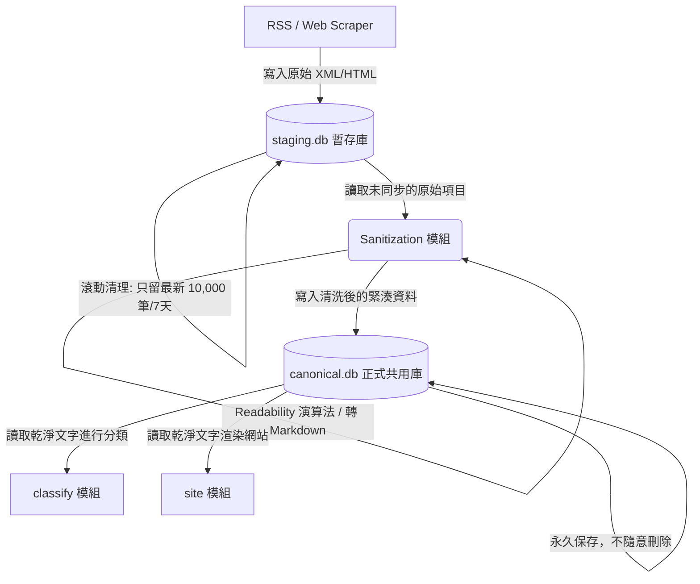

# 提案：引入暫存區儲存（Staging Storage）與資料清洗機制之架構重構

**文件狀態：** 提案草稿  
**日期：** 2026-06-05  
**定位：** 本文件旨在分析當前 UAP 聚合系統在 Ingest 到 Classify 流程中的資料儲存缺陷，並提出建立雙資料庫（Staging & Canonical）與可插拔清洗管道（Sanitization Pipeline）的重構建議。

---

## 1. 當前系統的缺陷與困境分析

在目前的架構設計中，原始 RSS 的 XML/HTML 數據是直接寫入主資料庫 `canonical.db` 的 `source_item` 資料表中。在運行第二個模組 `classify` 時，這種「原文直入」的策略暴露出以下幾個關鍵痛點：

### A. 執行成本偏高（Token 浪費）
許多網站的 RSS Feed 摘要（Summary）中直接嵌入了完整的網頁 HTML、行內樣式表（CSS）與排版程式碼。
* **現狀：** 程式直接將此類未經處理的 HTML 發送給 LLM API。
* **痛點：** 結構標籤被 Tokenizer 拆解後會消耗數萬個無謂的 Token。這導致 **API 費用暴增 10 到 100 倍**，並極易觸發供應商的 Rate Limit 限制。

### B. 資訊密度偏低（Lost in the Middle 效能衰退）
LLM 在處理長度極長但有效資訊密度極低的上下文時，對位於文本中段的關鍵內容敏感度會顯著下降。
* **現狀：** 龐大的 HTML 代碼稀釋了真正的正文主旨。
* **痛點：** 導致 LLM 無法精確捕捉核心概念，進而降低了分類（Classify）結果的精準度。

### C. 廣告與無關連結的噪訊干擾
網頁原始碼中常包含頁尾導航、側邊欄「相關連結」或廣告。
* **現狀：** LLM 會完整閱讀這些噪訊。
* **痛點：** 例如一篇無關新聞因側邊欄推薦了「UFO 探索熱門討論」，可能會被 LLM 誤判為 `core` 類別，大幅干擾了資料品質。

### D. 「不可變性」與「儲存空間」的兩難
* **不可變性價值：** 保留原始 HTML 數據是為了在分類出錯時能夠「還原現場」以進行排錯或重新解析。
* **儲存代價：** 僅僅 20 筆測試資料中，高字數項目就佔了極大空間。當前資料庫中只有 6.7% 的超大項目，卻貢獻了近 45% 的資料庫實體體積。這將使 SQLite 檔案在長期運行下迅速膨脹。

---

## 2. 建議重構方向：雙資料庫分層架構（ETL 模式）

為了解決上述「開發需要原文」與「生產需要高能效」的兩難，建議將原有的單一資料庫結構，重構為**暫存區（Staging）**與**正式區（Canonical）**分離的雙資料庫架構。

### A. staging.db（暫存緩衝庫）
* **定位：** Ingest 模組的私有暫存區（不對外曝露給其他模組）。
* **儲存內容：** 存放最原始、帶有 HTML 原始碼的 RSS 數據。
* **生命週期管理：** 引入「滑動窗口（Sliding Window）」機制，定時刪除舊資料（例如只保留最新 10,000 筆或最新 7 天），並在刪除後執行 `VACUUM`，使其實體硬碟體積永遠受控。

### B. Sanitization Pipeline（清洗與同步管道）
* **定位：** 介於 Ingest 與 Classify 之間的可插拔（Pluggable）中介步驟。
* **主要功能：**
  1. **正文提取：** 使用通用 **Readability 演算法**（利用文字密度與鏈結密度評估），去除導航欄、頁尾與廣告，僅提取文章主體。
  2. **格式轉化：** 將 HTML 清洗並轉換為 **Markdown 純文字**（如 `html2text`），徹底丟棄 `div`、`span` 與樣式表，僅保留段落與標題結構。
  3. **長度截斷：** 針對過長文本進行前 N 字元截斷，控制 Token 成本。
* **寫入目標：** 將清洗完畢、高密度的乾淨資料寫入主資料庫 `canonical.db`。

### C. canonical.db（正式共用主資料庫）
* **定位：** 系統的主資料源（即 [`CANONICAL_DATA_MODEL_DRAFT.md`](file:///C:/Users/user/documents/derived-work/docs/CANONICAL_DATA_MODEL_DRAFT.md) 定義的核心庫）。
* **儲存內容：** 僅儲存清洗後的 Markdown 文字與分類結果，保證高資訊密度。
* **生命週期：** 永久保存，不隨意刪除。因資料已被壓縮 90% 以上，儲存成本極低。

---

## 3. 架構決策與權衡討論

| 優化方案 | 優點 | 缺點 / 成本 |
| :--- | :--- | :--- |
| **方案 1：雙資料庫分離 (Staging + Canonical)**  *(本提案推薦)* | 1. 完美符合模組邊界責任，主庫極度輕量化。 2. 暫存庫保留原始碼便於排錯。 3. 支援滾動式容量清理。 | 需要維護兩個資料庫連線，以及同步/標記處理進度的邏輯。 |
| **方案 2：單資料庫雙欄位** | 1. 單一連線，交易（Transaction）容易控制。 2. SQL 直接 JOIN 即可查詢原文，便於排錯。 | 1. 依然無法避免 `canonical.db` 因原始碼而體積膨脹的問題。 2. 無法輕易對單一欄位進行滾動式物理收縮（`VACUUM`）。 |
| **方案 3：原地覆寫 (In-place Overwrite)** | 1. 完全不需修改現有 `classify` 讀取邏輯。 2. 實作最簡單、成本最低。 | 1. 原始 HTML 永久遺失，失去「後悔藥」機制。 2. 覆寫後必須執行 `VACUUM` 否則無法釋放硬碟空間。 |

---

## 4. 對現有模組的影響與遷移計畫

1. **Ingest 模組 (`modules/ingest/`)**：
   * 需要將寫入目標從原本的 `canonical.db` 改為私有的 `staging.db`。
   * 新增 `sanitize_sync` 子命令，負責將 `staging.db` 中的內容清洗並同步至 `canonical.db` 的 `source_item` 表。
   * 新增定時清理 `staging.db` 的排程機制。

2. **Classify 模組 (`modules/classify/`)**：
   * **完全不需要修改代碼**。因為它原本就是讀取 `canonical.db` 的 `source_item`。在重構後，它讀到的 `summary` 自動會是 Sanitization 處理後的乾淨文字。

3. **相關規劃文件**：
   * 需同步更新 [`MODULE_BOUNDARIES.md`](file:///C:/Users/user/documents/derived-work/docs/MODULE_BOUNDARIES.md) 中關於 Ingest 與 Canonical 庫的權責劃分。

---

## 5. 跨模組正文抓取與清洗邏輯之共享架構展望

### A. 未來潛在需求場景
隨系統演進，除了 Ingest 模組在背景批次處理 RSS 外，未來在 **Review（審核）** 或 **Edit（編修）** 階段，不論是人工審查員或 AI Agent，都有可能需要「輸入一個外部 URL，即時獲取並查看其經過清洗後的全文內容」。這並不屬於 Ingest 的定時批次排程範疇。

### B. 核心邏輯的共性與差異
* **共性（90% 底層一致）：** 即時抓取與批次擷取本質上都是對指定 URL 進行 HTTP GET 請求，取得 HTML 後透過 Readability 演算法提取正文並轉化為 Markdown。
* **差異：** Ingest 是「批次/定時排程/寫入資料庫」；而 Review/Edit 是「單次/即時互動/記憶體中渲染」。

### C. 建議設計模式：無狀態共享核心引擎（Shared Stateless Scraper Engine）
為了避免 Review/Edit 模組直接與複雜的 Ingest 模組排程器產生強耦合，建議不要將「抓取與清洗」做成一個帶有狀態（Stateful）與 CLI 的重量級獨立模組，而是將其封裝為一個**無狀態的共享核心工具包（Shared Utility SDK）**：

1. **核心模組封裝**：將 HTTP 抓取與 Readability 清洗邏輯封裝在一個獨立的共享模組或工具類中（例如 `modules/common/scraper_engine.py`），該模組不包含任何資料庫狀態，僅提供乾淨的輸入輸出接口，例如 `fetch_and_clean(url: str) -> str`。
2. **多重呼叫源**：
   * **Ingest 模組**：在批次同步時，調用此共享引擎將結果寫入暫存庫及主資料庫。
   * **Review/Edit 模組**：當 Agent 或人工需要即時檢索時，直接調用同一個共享引擎進行實時抓取與渲染，而不需經過 Ingest 的排程資料表。
3. **優勢**：在保持代碼重用性的同時，維護了低耦合的系統邊界。

