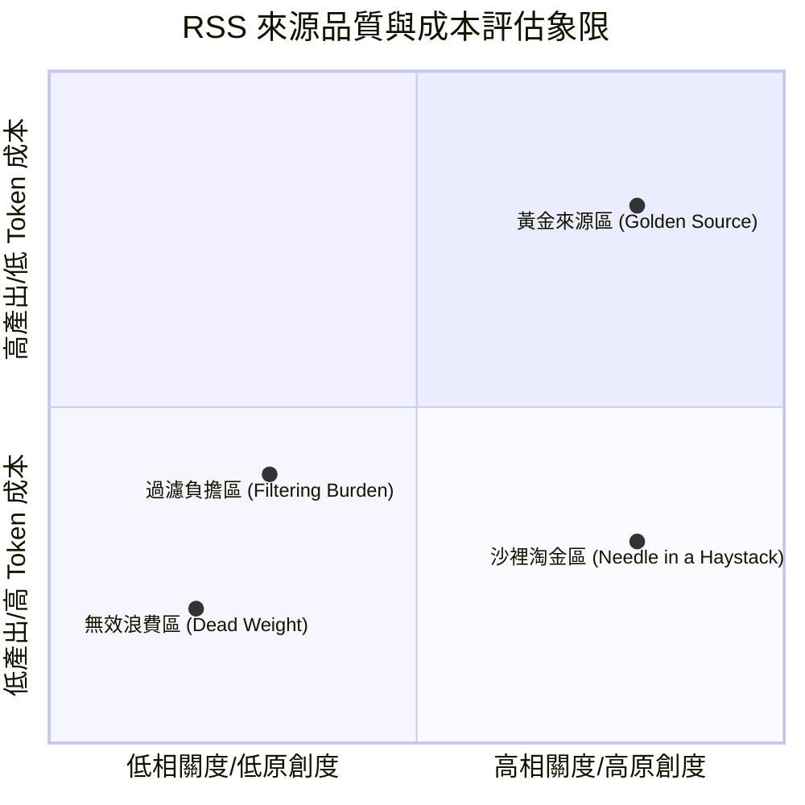

# Ingest RSS 來源品質分析與優化策略藍圖 (SOURCE_ANALYSIS_BLUEPRINT)

本文件定義了對 Ingest 模組中 RSS 來源進行細緻拆解、品質評估及成本優化的分析方案與策略藍圖。此藍圖旨在以最低的工程實作成本（非侵入式，僅基於現有資料庫查詢），協助營運團隊優化內容來源、降低 LLM 運算帳單，並確保內容品質。

---

## 1. 核心分析指標 (Core Metrics)

為客觀量化每個來源的價值與成本效益，分析模型定義以下四個維度的指標：

| 指標名稱 | 英文定義 | 計算公式 / 邏輯 | 業務意義 |
| :--- | :--- | :--- | :--- |
| **連線健康度** | Fetch Success Rate | $\frac{\text{Fetch Success Count}}{\text{Total Fetch Attempts}}$ | 用於前置過濾。連線成功率低於 50% 的來源，直接亮黃燈進入「連線修復流程」，暫不評估內容品質。 |
| **主題相關度** | Relevance Rate | $\frac{\text{Classify Core} + \text{Classify Adjacent}}{\text{Total Ingested}}$ | 評估來源與 UAP/UFO 主題的契合度，過低代表雜訊過多。 |
| **去重獨特率** | Unique Contribution Rate | $\frac{\text{Curate Approved (未被去重且發布)}}{\text{Total Ingested}}$ | 排除因轉載、抄襲而在 Ingest 階段就被去重標記（dedup）過濾掉的內容，識別真正具有原創高價值的來源。 |
| **過濾成本係數** | LLM Cost Factor | $\frac{\text{Total Classified}}{\text{Curate Approved}}$ | 代理指標（Proxy）。代表每篩選出 1 篇發布文章，LLM 需要閱讀的文章總數。數值越高，Token 帳單越貴。 |
| **綜合產出率** | Overall Yield | $\frac{\text{Curate Approved}}{\text{Total Ingested}}$ | 評估該來源的「性價比」終極指標。每抓取 100 篇，最後能上架幾篇。 |

---

## 2. 來源品質四象限分類 (Source Classification Quadrants)

根據分析指標，系統會將連線健康的來源劃分為以下四個象限，並採取相應策略：



### 1. 🥇 黃金來源區 (Golden Source)
* **特徵**：產出率（Yield）高（> 60%），過濾成本低（Cost Factor < 2.0），且有持續的原創貢獻。
* **策略**：**保留並提高抓取頻率**。

### 2. 🥈 沙裡淘金區 (Needle in a Haystack) — 權威保護
* **特徵**：絕對更新頻率極低，但只要更新就是重磅消息。
* **策略**：**強制納入「權威保護名單」**（針對 Category 1 政府公開、Category 3 科學研究）。即使 Yield 為 0% 也不自動禁用，改以人工定期審查。

### 3. 🥉 過濾負擔區 (Filtering Burden)
* **特徵**：抓取量巨大且主題相關（如社群 Feed / Reddit），但雜訊極多，合格率極低，導致過濾成本（Cost Factor）極高。
* **策略**：
  * **降級模型**：將前置 Classify 模組降級為更便宜的 LLM 模型（如 Gemini Flash）。
  * **收緊過濾**：在 Ingest 階段引入關鍵字排除規則，減少送給 LLM 閱讀的總量。

### 4. ❌ 無效浪費區 (Dead Weight)
* **特徵**：幾乎沒有獨特原創貢獻，大機率在 Classify 階段就被判定為 Irrelevant，或是全是 Low-Context 的簡短摘要。
* **策略**：**直接在 `sources.yaml` 中關閉（`enabled: false`）**。

---

## 3. 權威保護與前置過濾機制 (System Safety & Filtering)

為了避免自動化分析導致「誤殺」重要來源，分析流程必須實作以下兩大防線：

1. **連線異常隔離防線**：
   在執行品質評估前，連線成功率（Fetch Success Rate）< 50% 的來源會被隔離至「連線診斷清單」，避免因伺服器死機或被阻擋而產生的 `0 產出` 數據干擾了內容品質分析。
2. **語意類別保護防線**：
   凡是綁定 `category_id: 1`（政府官方與公開披露）與 `category_id: 3`（科學驗證與前沿研究）的來源，其品質判定會被強制附加 `[AUTHORITY]` 標記。此標記將豁免任何自動化禁用邏輯，僅作人工覆核提示。

---

## 4. 輕量化實作邏輯 (Lightweight SQL Implementation)

本方案無需改動現有系統的資料表結構（Schema），僅需透過單一 SQL 查詢與 Python 分析指令碼，即可自資料庫 `data/canonical.db` 計算出所有指標。

### 核心 SQL 查詢邏輯：
```sql
SELECT 
    si.source_id,
    -- 1. 抓取與連線指標
    COUNT(DISTINCT fa.fetch_attempt_id) as total_fetch_attempts,
    SUM(CASE WHEN fa.outcome = 'success' THEN 1 ELSE 0 END) as success_fetch_attempts,
    
    -- 2. Ingest 階段總數
    COUNT(si.source_item_id) as total_ingested,
    
    -- 3. 去重指標 (Unique Contribution)
    -- （有些項目因為重複，沒有進入後續的 classify/curate 階段）
    SUM(CASE WHEN idm.dedup_marker_id IS NOT NULL THEN 1 ELSE 0 END) as deduped_count,
    
    -- 4. Classify 階段指標
    SUM(CASE WHEN cr.topic_class IN ('core', 'adjacent') THEN 1 ELSE 0 END) as classify_passed,
    SUM(CASE WHEN cr.topic_class = 'irrelevant' THEN 1 ELSE 0 END) as classify_irrelevant,
    SUM(CASE WHEN cr.topic_class = 'unknown' THEN 1 ELSE 0 END) as classify_unknown,
    
    -- 5. Curate 階段產出 (Yield)
    SUM(CASE WHEN cd.curate_status = 'approved' THEN 1 ELSE 0 END) as curate_approved,
    SUM(CASE WHEN cd.curate_status = 'rejected' THEN 1 ELSE 0 END) as curate_rejected
    
FROM source_item si
LEFT JOIN fetch_attempt fa ON si.source_id = fa.source_id
LEFT JOIN classification_result cr ON si.source_item_id = cr.source_item_id
LEFT JOIN curation_decision cd ON si.source_item_id = cd.source_item_id
LEFT JOIN ingest_dedup_marker idm ON si.source_item_id = idm.source_item_id
GROUP BY si.source_id;
```

---

## 5. 後續實作規劃 (Next Steps)

當營運團隊準備將此藍圖落地為可執行工具時，執行步驟如下：
1. **編寫分析工具**：在 `modules/ingest/src/` 中編寫 `analytics.py`，載入上述 SQL 並進行指標計算。
2. **輸出 Markdown 報告**：每次執行分析時，自動將四象限排行與健康狀況寫入 `known_issues/SOURCE_QUALITY_RANKING.md`。
3. **整合 CLI 介面**：將分析功能整合進 `modules/ingest/src/cli.py`，例如新增 `python -m modules.ingest.src.cli analyze-sources` 指令，方便運維人員一鍵分析。
