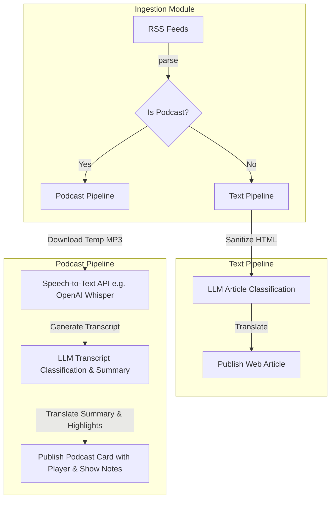

# Podcast/Multimedia Separation Proposal

This document proposes an architectural enhancement to separate standard text-based articles from podcast/multimedia audio feeds within the exopolitics ingestion, curation, and presentation pipelines.

## Background
Currently, the pipeline treats podcast RSS feeds (e.g., Megaphone, Libsyn, Art19 feeds for IDs 66-73) identically to text articles. It normalizes the audio enclosure URL as `canonical_url` and sends the text description (show notes) to the LLM for classification and curation.

While functional, this approach has limitations:
1. **Metadata Dependency**: The classification is entirely dependent on the quality of show notes written by the podcast creator. If show notes are short or non-descriptive, the LLM will fail to classify the content accurately.
2. **No Deep Analysis**: The pipeline cannot analyze the actual spoken content of the podcast episode.
3. **Frontend UX Blending**: The frontend displays podcast entries as standard articles, whereas users expect audio players, play/pause controls, and structured audio transcripts or bullet-point summaries.

---

## Proposed Architecture

### 1. Ingestion & Configuration Tagging
* **Metadata Identification**:
  * Keep standard fields but utilize a dedicated `category_id` (e.g., `6` for `multimedia-podcasts` in [categories.yaml](file:///C:/Users/user/Documents/exopolitics/modules/ingest/config/categories.yaml)) to cleanly separate podcasts at the configuration layer.
  * Alternatively, add a `media_type` attribute (with values `article` or `podcast`) in the configuration schema once schema extensions are prioritized.
* **Enclosure Fallback**: Continue using the `<enclosure>` tag extraction fallback (implemented in [parser.py](file:///C:/Users/user/Documents/exopolitics/modules/ingest/src/parser.py#L28-L33)) to resolve the direct audio MP3 link for all podcast sources.
* **Substack Hybrid Feeds Handling**: Substack feeds (like ID 68) are hybrid, containing both audio podcast episodes (with `<enclosure>` tags) and plain-text articles. The pipeline must dynamically inspect each parsed item: if `<enclosure>` is present, route to the Audio/Podcast Pipeline; if absent, treat it as a standard text article.

### 2. The Multimedia Ingestion Pipeline
If an item is tagged as a podcast:
* **Audio Downloader**: Downloads the MP3 file from the enclosure URL to a temporary scratch directory.
* **Transcription Service**: Sends the audio file (or slices) to a transcription engine (e.g., OpenAI Whisper API or local Whisper models) to generate a full text transcript.
* **LLM Classification & Synthesis**:
  * Feed the generated transcript to the LLM.
  * Ask the LLM to classify relevance (core/adjacent/irrelevant).
  * Generate a highly structured summary: **Key Takeaways (Bullet Points)**, **Timestamps**, and **Key Entities Mentioned**.
* **Translation**: Translate the generated takeaways and summary rather than the full transcript to conserve translation API tokens.

### 3. Database Schema Adjustments
Extend the database tables (or create a sidecar database table `podcast_metadata`) to store:
* `audio_url` (text)
* `transcript` (text, optional)
* `key_takeaways` (JSON/text)
* `duration_seconds` (integer)

### 4. Frontend Rendering (Astro)
* Create a dedicated **Multimedia/Podcast Hub** section.
* Render interactive card components featuring:
  * Inline HTML5 audio players (`<audio>` tags) linked to the enclosure URL.
  * Expandable accordion components containing the translated key takeaways and transcripts.
  * Platform links (e.g. Spotify, Apple Podcasts) based on the feed publisher.
