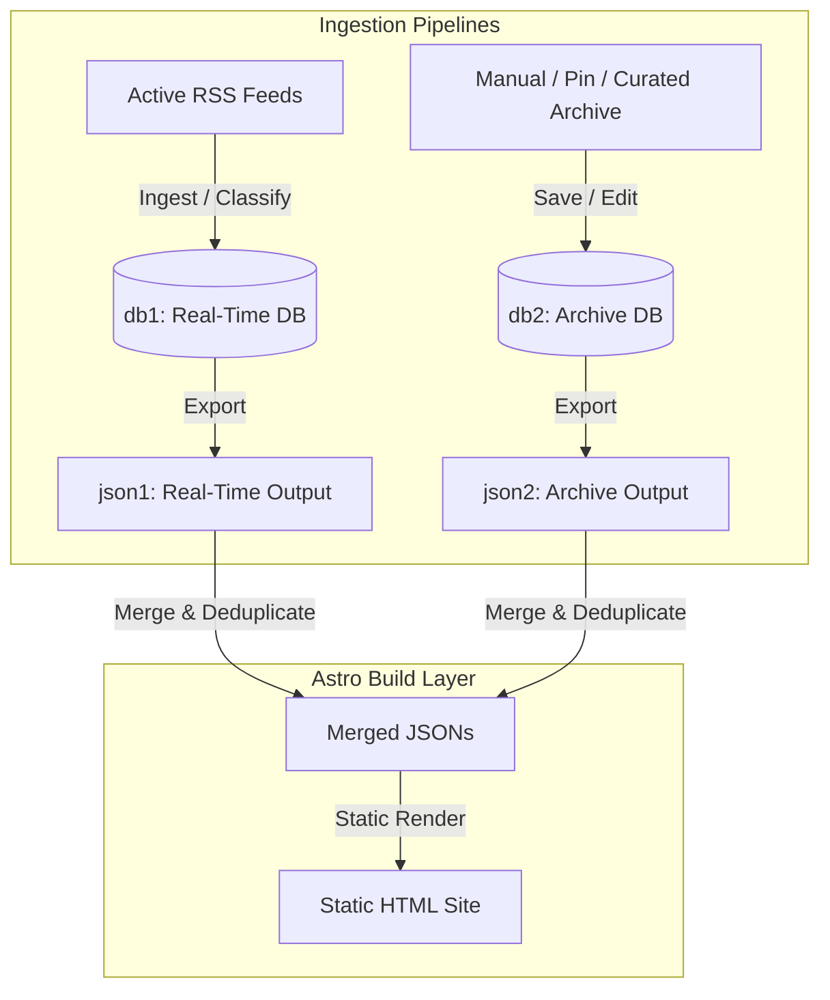

# RSS Source Lifecycle and Dual-Database Merge Strategy

**Status:** Proposed Architecture Draft  
**Created:** 2026-07-20  
**Author:** exopolitics Development Team  

---

## 1. Background & Problem Statement

### 1.1 The Nature of RSS Feeds
RSS feeds are transient sliding windows broadcasting only the most recent $N$ items (typically 10-50). They are designed for notification and real-time updates, not for long-term database archives. Once an article rotates out of a remote feed's XML payload, it cannot be downloaded again through the standard ingestion pipeline.

### 1.2 Configuration & Database Bloat
As the system matures, the configuration files and databases face two main bottlenecks:
1.  **`sources.yaml` Cognitive Bloat**: The list of sources grows with retired or dead personal blogs (about 23% of the current 101 sources are permanently disabled). Keeping these in `sources.yaml` increases the LLM context window size and overhead during code edits or configuration validation.
2.  **Unclear Retention Boundaries**: Mixing real-time transient news alerts with high-value historical archives in a single database (`canonical.db`) forces developers to balance database size limits with data preservation.

### 1.3 Separation of Positioning Requirements
The portal has two distinct requirements with different priorities:
1.  **Preservation and Forwarding of Real-Time Messages (High Priority)**: Ensuring the latest UAP news is categorized and published instantly.
2.  **Preservation and Forwarding of Historical Messages (Secondary Priority)**: Preserving high-value curated content (such as congressional hearings, FOIA documents, and academic research) for long-term reference.

---

## 2. Proposed Architecture: Dual-Database with Build-Time Merge

To resolve the conflict between real-time responsiveness and long-term maintainability, the system can adopt a dual-database pipeline that merges at the static site rendering layer.

### 2.1 The Real-Time Layer (Speed/Speed Layer)
*   **Database (`db1`)**: Holds transient real-time items. Can be wiped and reset periodically (e.g. quarterly) to keep execution overhead low and avoid migration issues.
*   **Source Config**: Controlled by `sources.yaml` (Active/Standby feeds only).
*   **Output**: Exported as `json1` files representing recent news.

### 2.2 The Archive Layer (Serving/Batch Layer)
*   **Database (`db2`)**: A persistent database holding curated items of long-term value (e.g., articles manually selected from `db1` to be archived).
*   **Source Config**: Controlled by `sources_archived.yaml` (permanently retired/archived sources) to preserve metadata references.
*   **Output**: Exported as `json2` files representing monthly historical archives.

---

## 3. Conflict Resolution & Deduplication Rules

During the Astro build process, the static site generator reads both `json1` (real-time) and `json2` (archived) data. When articles overlap (due to inheritance or cross-posting), the following deduplication rules apply:

### 3.1 Stable Identifier Key: `canonical_url`
Since titles, summaries, and translations can be manually edited in the historical database (`db2`), string-based matching of titles or contents is unreliable.
*   **Deduplication Key**: The original source website URL (`canonical_url`) is used as the unique key. It is immutable and persists across both databases.

### 3.2 Exact Duplicate Rule (Archive Overwrite)
If the same `canonical_url` exists in both `json1` and `json2`:
*   **Rule**: Discard the version from `json1` and display the version from `json2`.
*   **Rationale**: The archived version in `json2` represents a polished output that has gone through manual curation, translation adjustments, or editor remarks.

### 3.3 Near-Duplicate Rule (Cross-Source Clustering)
If different RSS feeds publish similar wire-service reports (e.g. AP News) at similar timestamps:
*   **Rule A (Quality Tiering)**: Assign quality tiers to sources (e.g. Tier 1: NewsNation, Tier 2: Blogs). If a duplicate is detected, keep the highest Tier article.
*   **Rule B (Grouping)**: Group similar articles in the UI under one primary card (using the curated/archived version) and display alternative source links (e.g. *"Also covered by: [Source B](url)"*) underneath.

---

## 4. Operational Guidelines for Future Development

1.  **Manual Split Trial**: Maintain a separate `sources_archived.yaml` file for retired sources to reduce `sources.yaml` size, accepting the temporary `Unknown Source` warnings in analysis reports during the trial phase.
2.  **Decouple Site Generators**: When scaling up, design the site rendering pipeline to load multiple index/archive directories instead of assuming a single export origin.
