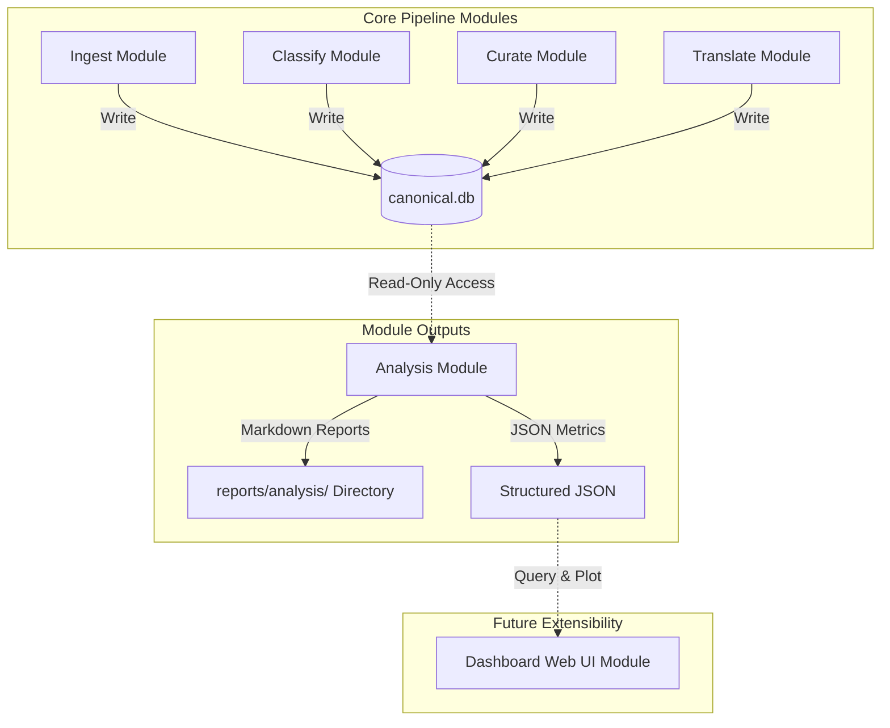

# Analysis Module Boundaries

This document defines the system role, boundary principles, and operational limits of the `analysis` module.

## 1. System Role & Boundaries

The `analysis` module is a **read-only consumer** and a **cross-module analysis layer**.

### 1.1 Boundary Principles
*   **No Operational Execution**: The `analysis` module does not execute feed fetching (`ingest`), classification (`classify`), curation (`curate`), translation (`translate`), or publishing (`publish`).
*   **Decision Recommender, Not Owner**: The module outputs recommendations (e.g., source disabling suggestions or model downgrade proposals), but the responsibility of applying changes to configurations (such as `sources.yaml` in the `ingest` module) remains strictly with the respective module's operational workflow.
*   **No Canonical State Writes**: The module may write its own reports or temporary cache files, but it must never write to or modify canonical operational tables (such as `source_item`, `classification_result`, or `curation_decision`) to preserve data integrity.

### 1.2 Module Boundary Diagram

