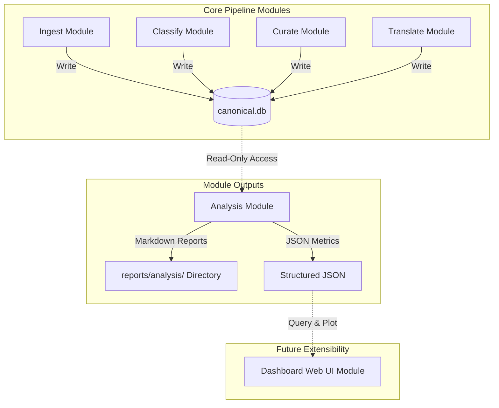

# Analysis Module Technical Specification (ANALYSIS_SPECIFICATION)

This document defines the software architecture, boundary responsibilities, core metrics formulas, quadrant evaluation model, and the CLI and reporting contracts for the `analysis` module. It is intended to guide the implementation and ensure boundary alignment with other core modules in the system.

---

## 1. System Role & Boundaries

The `analysis` module is a **read-only consumer** and a **cross-module analysis layer**.

### 1.1 Boundary Principles
*   **No Operational Execution**: The `analysis` module does not execute feed fetching (`ingest`), classification (`classify`), curation (`curate`), translation (`translate`), or publishing (`publish`).
*   **Decision Recommender, Not Owner**: The module outputs recommendations (e.g., source disabling suggestions or model downgrade proposals), but the responsibility of applying changes to configurations (such as `sources.yaml` in the `ingest` module) remains strictly with the respective module's operational workflow.
*   **No Canonical State Writes**: The module may write its own reports or temporary cache files, but it must never write to or modify canonical operational tables (such as `source_item`, `classification_result`, or `curation_decision`) to preserve data integrity.

### 1.2 Module Boundary Diagram


---

## 2. Core Metrics & Mathematical Definitions

To objectively evaluate the pipeline, the `analysis` module is responsible for calculating the following metrics:

### 2.1 Source Health Metrics

*   **Fetch Success Rate**
    $$\text{Fetch Success Rate} = \frac{\text{Successful Fetches (Outcome = 'success')}}{\text{Total Fetch Attempts}}$$
*   **Error Categorization Rate**
    Categorizes failed fetch attempts by error profile (e.g., `404 Not Found`, `403 Forbidden`, `DNS Resolution Error`, `SSL Error`) to pinpoint connection or anti-scraping issues.

### 2.2 Pipeline Funnel & Conversion Metrics

Evaluates data loss patterns throughout the ingestion and filtering process:

*   **Overall Yield**
    $$\text{Overall Yield} = \frac{\text{Curate Approved Count}}{\text{Total Ingested}}$$
*   **Low-Context Bypass Rate**
    $$\text{Low-Context Bypass Rate} = \frac{\text{Low-Context Ingested Items (is_low_context = true)}}{\text{Total Ingested}}$$
    *Note: Used to monitor sources like Google News RSS, which only contain tiny snippet titles and trigger low-context bypasses.*
*   **Relevance Rate**
    $$\text{Relevance Rate} = \frac{\text{Classify Core} + \text{Classify Adjacent}}{\text{Total Ingested}}$$

### 2.3 Source Quality & Cost-Effectiveness

Measures source quality against LLM processing costs and uniqueness:

*   **LLM Cost Factor**
    $$\text{LLM Cost Factor} = \frac{\text{Total Classified}}{\text{Curate Approved}}$$
    *Interpretation: Represents the average number of items classified by the LLM to yield one approved article. A higher factor indicates higher filtering overhead and cost.*
*   **Unique Contribution Rate**
    $$\text{Unique Contribution Rate} = \frac{\text{Curate Approved (Undeduped)}}{\text{Total Ingested}}$$
    *Note: This acts as a proxy for the "final effective unique contribution", representing the proportion of ingested items that eventually turn into unique approved items, rather than a simple non-deduped rate (which is $1 - \text{Dedup Rate}$).*

### 2.4 Translation Performance Metrics

Evaluates translation pipeline reliability, latencies, and costs:

*   **Translation Success Rate**
    $$\text{Translation Success Rate} = \frac{\text{Successful Translations}}{\text{Total Translation Attempts}}$$
*   **Translation Failure & Retry Rates**
    Tracks final failure counts and average retry counts due to API errors, timeouts, or rate limits.
*   **Average Latency**
    $$\text{Average Latency} = \text{Average}(\text{Translation Completed Time} - \text{Curation Approved Time})$$
*   **Translation Completion Rate**
    The percentage of approved curation items (`approved_content_record`) that successfully complete translation.
*   **Translation Stale Rate**
    The proportion of items that become stale due to upstream content modifications or excessive queue latency before translation completes.
*   **Translation Proxy Cost Share**
    Estimates translation LLM token expenses using total translated character counts or API request runs per locale as a proxy.

---

## 3. Source Quadrant Classifier

Based on the core metrics, the module categorizes sources with a $\text{Fetch Success Rate} \ge 50\%$ into four quadrants to output optimization recommendations:

```text
       High |
            |   🥈 Needle in a Haystack            |   🥇 Golden Source
            |   - Characteristics: Low overall      |   - Characteristics: High yield (>60%),
            |     yield but high authority value    |     low filtering cost.
Yield       |   - Strategy: Protect in list,        |   - Strategy: Keep and increase
(Yield)     |     manual periodic reviews.          |     fetch frequency.
            |---------------------------------------+---------------------------------------
            |   ❌ Dead Weight                      |   🥉 Filtering Burden
            |   - Characteristics: Extremely low    |   - Characteristics: High volume, high
            |     yield, high duplicates/low-context|     noise/LLM cost (e.g. Reddit).
            |   - Strategy: Disable in sources.yaml |   - Strategy: Tighten keywords/pre-filter
        Low |_______________________________________|_______________________________________
            Low                                                                             High
                                      Relevance Rate / Uniqueness
```

### 3.1 Authority Protection Mechanism
*   Sources with `category_id: 1` (Government & Official Disclosures) and `category_id: 3` (Scientific Validation & Research) are tagged with `[AUTHORITY]`.
*   These sources are **exempt** from automated disable recommendations, protecting low-frequency but critical sources from being auto-disabled.

### 3.2 Fetch Health Isolation
*   Sources with a $\text{Fetch Success Rate} < 50\%$ are temporarily isolated to a "Connection Diagnostics List".
*   They are excluded from content-quality analysis to prevent transient connection issues or Cloudflare blocks from skewing overall quality metrics.

---

## 4. CLI Specification

The `analysis` module provides a command-line interface via `python -m modules.analysis.src.cli`.

### 4.1 Unified CLI Options
To ensure consistency, all report-generating subcommands (`analyze-sources`, `analyze-funnel`, `analyze-translation`) must support the following arguments:
*   `--days INTEGER`: Specifies the lookback window in days (default: `7`).
*   `--format [markdown|json]`: Specifies the output format (default: `markdown`).
*   `--output-dir PATH`: Directory path where the report should be saved (default: `reports/analysis/`).
*   `--stdout`: If set, prints the report content directly to terminal standard output instead of writing it to a file, facilitating pipeline integration.

### 4.2 Subcommand Details

#### 4.2.1 `analyze-sources`
Analyzes RSS source health and content quality.
*   **Behavior**:
    1.  Reads `fetch_attempt` to compute success rates and isolate failing feeds.
    2.  Reads `source_item`, `classification_result`, `curation_decision`, and `ingest_dedup_marker` to compute Yield, Relevance, Unique Contribution, and LLM Cost Factor.
    3.  Applies the quadrant classifier and authority protection flags.
    4.  Generates [SOURCE_QUALITY_REPORT.md](file:///C:/Users/user/Documents/exopolitics/reports/analysis/SOURCE_QUALITY_REPORT.md) (or JSON equivalent) in the output directory.

#### 4.2.2 `analyze-funnel`
Analyzes conversion rates and bottlenecks across pipeline stages.
*   **Behavior**:
    1.  Calculates the transition rate between pipeline stages.
        *   *MVP Note: The initial MVP only guarantees calculations up to the curation stage (Ingested -> Deduped -> Classify -> Curate). Translate and Publish stages will be integrated as data availability and schemas stabilize.*
    2.  Tracks low-context bypass trends.
    3.  Analyzes common rejection patterns in curation.
    4.  Generates [PIPELINE_FUNNEL_REPORT.md](file:///C:/Users/user/Documents/exopolitics/reports/analysis/PIPELINE_FUNNEL_REPORT.md).

#### 4.2.3 `analyze-translation`
Analyzes translation pipeline efficiency, failures, and latency.
*   **Behavior**:
    1.  Calculates success, failure, and retry rates per language.
    2.  Calculates average latency and stale rates.
    3.  Estimates translation proxy cost shares per locale.
    4.  Generates [TRANSLATION_PERFORMANCE_REPORT.md](file:///C:/Users/user/Documents/exopolitics/reports/analysis/TRANSLATION_PERFORMANCE_REPORT.md).

---

## 5. Dashboard Integration Contract

Structured JSON files generated by this module can be directly consumed by the future `dashboard` module:
*   **Data Contract**: The `analysis` module exposes underlying Python querying functions and CLI JSON outputs as a stable data contract.
*   **Presentation Layer Responsibility**: The `dashboard` module (e.g. Streamlit app) is responsible *only* for rendering the UI (scatter charts for quadrants, bar charts for funnel stages) and must not implement SQL queries or metric formulas directly. This maintains a clean separation of concerns.
