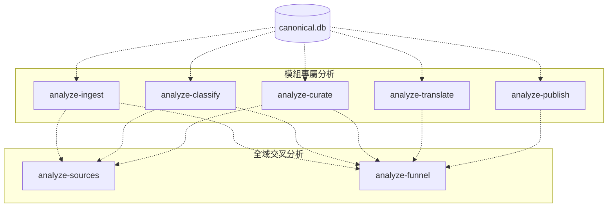

# CLI Module Deconstruction Proposal (CLI 模組解構提案)

本文件提出將 `analysis` 模組定位為同時承載 **「模組專屬分析 (Module-Specific Analytics)」** 與 **「全域交叉分析 (Cross-Module Aggregation)」** 的集中式唯讀分析層。此方案旨在解決原有規劃中指標職責重疊、LLM 成本中心監控失衡，以及未來管線擴充時的維護難題，同時避免把監控邏輯散落回各個業務模組。

---

## 1. 提案背景與動機 (Background & Rationale)

在先前的設計中，系統將分析指令簡化為三個：`analyze-sources`、`analyze-funnel` 與 `analyze-translation`。然而，在實際營運與資料庫統計後發現以下挑戰：

1. **Classify 模組的超額工作量未被單獨監控**：
   統計顯示，上游 `classify` 模組必須處理 **100% 的原始抓取文章**（共 8,072 篇），許多文章長達數千字，其 Input Token 的消耗量與 API 費用實際上是整個管線中**最大的成本中心**。相比之下，`translate` 模組僅處理經過人工核准的約 35% 文章。因此，`classify` 急需獨立的監控指標與分析工具。
2. **開發權責與模組邊界的對齊 (Ownership Alignment)**：
   目前儲存庫採用模組化結構（`modules/<module>/`）。如果分析指令能與模組一一對應（如 `analyze-classify`、`analyze-curate`），開發特定模組的工程師就能專注於該模組的效能指標，避免與其他階段的查詢邏輯耦合。
3. **更佳的擴充性 (SOLID Open-Closed Principle)**：
   當未來要引入新的 Pipeline 階段（例如 `edit` 模組）時，我們只需新增一個 `analyze-edit` 指令與對應查詢，而不需要修改既有的分析主程式與報表契約。

---

## 2. CLI 與能力分層原則 (CLI and Capability Layering)

在能力模型上，`analysis` 內部可以明確分成兩大類分析能力：



### 2.1 全域交叉分析能力 (Aggregation Capabilities)
負責跨多個模組進行數據關聯，生成高階營運報告：

1. **`analyze-sources` (來源品質與投資報酬率評估)**
   * **定位**：結合 Ingest, Classify, Curate，以來源為維度計算轉換率。
   * **核心指標**：Ingest Volume, Relevance Rate, Overall Yield, Source Quadrant Classification.
   * **用途**：協助管理員決定是否在 `sources.yaml` 中停用或調整特定訂閱源。
2. **`analyze-funnel` (管線時效與轉化漏斗)**
   * **定位**：分析串聯所有模組的漏斗轉化率與階段延遲。
   * **核心指標**：E2E Pipeline Lead Time (端到端延遲), Stage Latency Suite (各階段排隊與執行時間差)。
   * **用途**：協助 DevOps 工程師找出管線塞車的瓶頸。

### 2.2 模組專屬分析能力 (Module-Specific Capabilities)
提供極簡、高內聚的單一模組效能檢視：

1. **`analyze-ingest` (抓取監控)**
   * **指標**：Fetch Success Rate, Run Success Rate, HTTP/DNS Error Code Distribution.
   * **用途**：排查網路連線、Cloudflare 擋爬蟲或 RSS 解析失敗。
2. **`analyze-classify` (LLM 分類監控 - 核心成本監控)**
   * **指標**：Sanitized Character Volume (Input Token 估算), Relevance Rate, Content Density Distribution, Classification Confidence Score.
   * **用途**：監控分類品質、AI 判斷信心度與最龐大的輸入 Token 費用。
3. **`analyze-curate` (人工/系統審查監控)**
   * **指標**：Curation Approval Rate, Curation Rejection Mix (Discard vs Rewrite), System vs Operator Decision Ratio.
   * **用途**：評估審查人員的工作效率與 AI 輔助審查的準確度。
4. **`analyze-translate` (翻譯監控)**
   * **指標**：Translation Success Rate, Translation Completion Rate, Output Character Volume by Language (Output Token 費用估算).
   * **用途**：評估多語系翻譯的穩定度與 API 翻譯輸出成本。
5. **`analyze-publish` (網頁發佈監控)**
   * **指標**：Publish Count, Language Coverage Rate, Export Rendering Delay (資料庫匯出渲染延遲).
   * **用途**：監控資料成功匯出並寫入 publish_export 靜態 JSON 的時效性。

### 2.3 採納建議：先模組化內部架構，再漸進擴張 CLI
本提案建議將「內部實作鏡像模組」與「外部 CLI 指令數量」分開決策：

1. **優先採納**：在 `queries/` 與 `services/` 中按模組拆分責任，避免查詢與運算邏輯變成大雜燴。
2. **漸進採納**：外部 CLI 不預設一次擴張為完整 7 個正式子指令。應先保留少數高價值入口，再視穩定指標與實際營運需求逐步新增。
3. **首批候選**：若需要新增 module-specific CLI，應優先考慮 `analyze-classify`，因其成本中心定位最明確，且與既有來源/漏斗報表的重疊最少。

---

## 3. 代碼實作架構設計 (Implementation Architecture)

為了確保分析能力擴張時程式碼依然乾淨易讀，底層代碼將採用 **CLI-Service-Query** 三層解耦設計。此設計首先服務於內部責任切分，不要求外部 CLI 立即對應到所有模組能力。

```text
modules/analysis/src/
├── cli.py                     # CLI Entrypoint (先註冊少數穩定子指令，後續再擴張)
├── config.py                  # 設定檔解析器 (載入 analysis_settings.yaml)
├── database.py                # 參數化 SQL 執行工具 (防止 SQL Injection)
├── queries/                   # 【資料庫存取層】僅存放純 SQL 查詢陳述句
│   ├── ingest_queries.py
│   ├── classify_queries.py
│   ├── curate_queries.py
│   ├── translate_queries.py
│   ├── publish_queries.py
│   └── aggregation_queries.py # 處理 sources/funnel 的跨表大 Join 查詢
└── services/                  # 【業務邏輯層】負責運算、套用門檻與象限決策
    ├── ingest_service.py
    ├── classify_service.py
    ├── curate_service.py
    ├── translate_service.py
    ├── publish_service.py
    ├── source_classifier.py   # 獨立的象限計算引擎
    └── funnel_calculator.py   # 獨立的百分位數 (p50/p90) 延遲計算器
```

### 3.1 此架構的優點
1. **單一職責 (Single Responsibility)**：每個 `service` 與 `query` 檔案均控制在 100-150 行內，邏輯極度聚焦，便於維護。
2. **高測試覆蓋率 (Testability)**：可以針對各別 `service` 的運算邏輯編寫獨立的單元測試（Unit Test），而不必 mock 整個資料庫或 CLI 環境。
3. **漸進演進 (Incremental Extension)**：未來要引入 `edit` 模組的分析時，可先在 `queries/` 和 `services/` 下新增 `edit` 相關檔案，再視成熟度決定是否暴露成正式 CLI 子指令，降低過早擴張 command surface 的風險。
