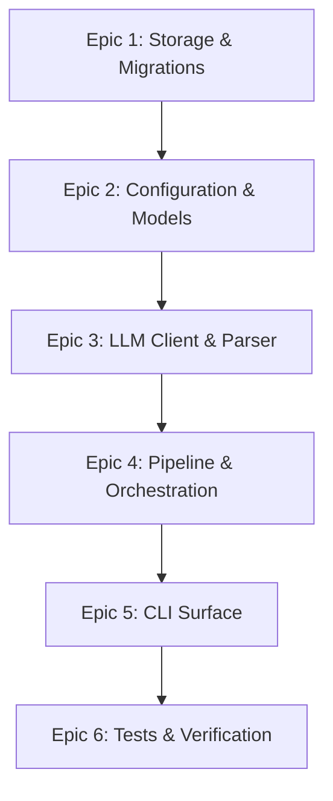

# Classify Module Implementation Plan

**Status:** Recommended implementation plan  
**Updated:** 2026-06-13  
**Target Module:** `modules/classify/`

---

## 1. Purpose

This document provides a detailed implementation plan for the rewritten `classify` module. It breaks down the work into concrete Epics, Stories, and Tasks suitable for engineering execution. It also distinguishes between contract-locked specifications, active policy requirements, and MVP-specific implementation choices.

---

## 2. Planning Rules

- **Contract Over Implementation:** Adhere strictly to the definitions in `DATA_CONTRACT.md`, `CLASSIFICATION_POLICY.md`, `PROMPT_CONTRACT.md`, and `EXECUTION_POLICY.md`.
- **Design Consistency (Not Runtime Dependency):** Refer to the existing design patterns of the `ingest` module (such as repository layout, config loaders, and migrations). However, to avoid tight cross-module runtime coupling, if the active `modules/ingest/` does not yet expose stable shared utilities, implement the minimal database and configuration loaders locally in `classify` instead of importing unstable ingest files.
- **Fail Fast & Gracefully:** Check configurations and database availability before execution. Isolate item-level LLM and parse failures so they do not crash the entire batch run.
- **Deferred Complexity:** Keep the MVP simple. Avoid implementing multi-worker task locking or classification history tracking until explicitly required by the roadmap. Keep database repository layers thin and concrete, avoiding over-abstraction (e.g., unnecessary adapters, interfaces, or service classes).

---

## 3. Contract-Locked and Active Policy Requirements

The following requirements must be followed during implementation:

### 3.1 Data Schema (Contract-Locked)
- Use the SQLite schema defined in [DATA_CONTRACT.md](file:///C:/Users/user/Documents/exopolitics/modules/classify/docs/DATA_CONTRACT.md) for the `classification_result` table.
- Enforce check constraints for `topic_class` (`'core'`, `'adjacent'`, `'irrelevant'`, `'unknown'`), `classification_confidence` (`0.0` to `1.0`), and other enum-like text fields.
- Establish `source_item_id` as `UNIQUE` with a foreign key referencing `source_item(source_item_id) ON DELETE CASCADE`.

### 3.2 Processing Queue (Contract-Locked)
- Retrieve pending items using the `LEFT JOIN` query specified in [DATA_CONTRACT.md](file:///C:/Users/user/Documents/exopolitics/modules/classify/docs/DATA_CONTRACT.md).
- Do not process items that have not yet had their text sanitized (ensure `source_item_text` is populated).

### 3.3 Active Policy: Low-Context Exclusion (Phase Policy)
- Exclude items where `source_item_text.is_low_context == 1` from the pending selection queue as defined in [DATA_CONTRACT.md](file:///C:/Users/user/Documents/exopolitics/modules/classify/docs/DATA_CONTRACT.md).
- Do not perform deterministic bypasses or write placeholder rows in the database. All items entering `classify` must proceed to LLM classification.

### 3.4 Prompting & Schema Enforcement (Contract-Locked)
- Construct prompts using the `single_item_v4` template from [PROMPT_CONTRACT.md](file:///C:/Users/user/Documents/exopolitics/modules/classify/docs/PROMPT_CONTRACT.md).
- Enforce the structured JSON Schema output constraint.
- Capture experimental sandbox signals (`content_timeliness`, `primary_evidence_type`) and persist them into the `additional_signals` JSON column, filtering out any unauthorized keys.

### 3.5 Execution & Concurrency Limits (Contract-Locked)
- Execute in bounded batches (default: `20` items per run).
- Limit parallel request concurrency (default: `3` parallel API requests controlled by `asyncio.Semaphore`).
- Control API rate limits (default: `60` requests per minute).
- Handle HTTP timeouts, 429 Rate Limits, and 5xx errors with up to `3` retries using exponential backoff (factor of `2.0`) and jitter.
- Protect database writes using item-level transactions (`BEGIN IMMEDIATE`), ensuring that writing failures for one item do not roll back other successfully classified items.

---

## 4. Accepted MVP Implementation Choices

These choices are recommended for the initial MVP execution:

- **Database Connection & Isolation:** Implement local database utilities within the `classify` module (mirroring `ingest`'s patterns) to avoid tight runtime coupling with `ingest`, unless a stable shared database library is formally established at the repository root.
- **HTTP/API Client:** Use `httpx.AsyncClient` or the official asynchronous `openai` Python SDK to submit classification requests.
- **CLI Command Entry Point:** Execute via `python -m modules.classify.src.cli` with subcommands `migrate` and `run`.
- **Validation Library:** Use `Pydantic` to load, merge, and validate `model_settings.yaml` and `prompt_templates.yaml`.

---

## 5. Engineering Breakdown (Epics, Stories, and Tasks)

Before writing code, establish the following directory skeleton:
```text
modules/classify/
├── config/
│   ├── model_settings.yaml
│   └── prompt_templates.yaml
├── docs/
│   ├── ...
│   └── IMPLEMENTATION_PLAN.md
├── src/
│   ├── migrations/
│   │   └── v001_initial_classify_tables.sql
│   ├── __init__.py
│   ├── cli.py
│   ├── config.py
│   ├── database.py
│   └── orchestrator.py
└── tests/
    ├── __init__.py
    └── test_classify.py
```



### Epic 1: Storage & Database Integration
Define the database schema migrations and implement simple database access.

* **Story 1: Directory Skeleton & Migration Setup**
  * **Task 1.1:** Create directory skeleton including `modules/classify/src/__init__.py`.
  * **Task 1.2:** Create SQL migration script in `modules/classify/src/migrations/v001_initial_classify_tables.sql` containing the DDL for `classification_result` and indices.
  * **Task 1.3:** Implement a local migration runner in `modules/classify/src/database.py` (mirroring `ingest`'s migration runner, but self-contained within `classify`).
* **Story 2: Database Repository Implementation**
  * **Task 2.1:** Implement the pending query SQL matching the data contract to load unclassified items.
  * **Task 2.2:** Create `ClassificationResultRepository` inside `database.py`. For reclassifications, use `INSERT ... ON CONFLICT(source_item_id) DO UPDATE` to update fields in-place, preventing surrogate key resets or row identity changes (avoiding standard `REPLACE`). Keep this repository simple and concrete, avoiding extra layers of abstraction.
  * **Task 2.3:** Implement item-level transaction wrapper (`BEGIN IMMEDIATE`) to isolate SQL writes.

### Epic 2: Configuration and Configuration Models
Load and validate active prompts and model configurations.

* **Story 1: YAML Config Loader**
  * **Task 1.1:** Define Pydantic models for `modules/classify/config/model_settings.yaml` (including providers, defaults, execution settings).
  * **Task 1.2:** Define Pydantic models for `modules/classify/config/prompt_templates.yaml` (storing prompt templates and versions).
  * **Task 1.3:** Create config loader logic to merge default request settings with selected provider parameters.

### Epic 3: LLM Client & Parser Integration
Build prompt constructors, integrate the LLM HTTP client, and parse structured JSON outcomes.

* **Story 1: Prompt Builder**
  * **Task 1.1:** Write prompt constructor that injects `title` and `sanitized_text` variables into the `single_item_v4` template.
* **Story 2: LLM Async Client**
  * **Task 2.1:** Implement asynchronous HTTP client wrapper for OpenAI-compatible endpoint.
  * **Task 2.2:** Support structured output response formats, enforcing the following priority hierarchy:
    1. Provider-native JSON Schema structured outputs (guaranteeing both valid JSON and correct schema fields).
    2. OpenAI-compatible `response_format={"type": "json_object"}` (guarantees valid JSON output structure).
    3. Application-level schema validation (using Pydantic or jsonschema) to parse and validate fields, acting as a fallback or safety reinforcement.
* **Story 3: Retry & Error Recovery**
  * **Task 3.1:** Implement exponential backoff retry handler with random jitter for timeouts, 429, and 5xx errors.
  * **Task 3.2:** Implement JSON schema parser & validator to double-check unstructured responses, triggering retries on schema violations.
  * **Task 3.3:** Parse and extract experimental metadata (`content_timeliness`, `primary_evidence_type`) to build the `additional_signals` JSON field.

### Epic 4: Pipeline Execution & Orchestration
Assemble the pipeline execution loop, enforcing concurrency, rate-limits, and routing policies.

* **Story 1: Low-Context Queue Filtering**
  * **Task 1.1:** Update pending query to filter out `is_low_context = 1` items (no classify-side routing/writing is required).
* **Story 2: Orchestration Loop**
  * **Task 2.1:** Implement batching query fetching up to `batch_size` items.
  * **Task 2.2:** Use `asyncio.Semaphore` to cap concurrent requests at `max_concurrent_requests`.
  * **Task 2.3:** Enforce rate limits (throttling requests to stay under rate limit per minute config).
  * **Task 2.4:** Implement error isolation: catch unhandled item exceptions, log them, and keep item pending by rolling back only the failing item transaction.

### Epic 5: Command-Line Interface
Build a user-facing CLI to run database migrations and execute classification batches.

* **Story 1: CLI Entry Point**
  * **Task 1.1:** Build `modules/classify/src/cli.py` parsing options using `argparse`.
  * **Task 1.2:** Support `migrate` subcommand (runs `v001_initial_classify_tables.sql`).
  * **Task 1.3:** Support `run` subcommand (executes pipeline run) with flags:
    * `--db-path` (custom SQLite path)
    * `--batch-size` (overrides default batch size)
    * `--config-dir` (custom config files location)
    * `--preview-prompts` (prints the structured prompt payloads for unclassified items, but does not invoke the LLM API or write to the database)
    * `--dry-run` (runs the complete classification process including LLM API calls, but suppresses commits for all item-level write transactions so no database changes are persisted)

### Epic 6: Tests & Verification
Validate contract enforcement and pipeline execution using high-value testing scenarios.

* **Story 1: Unit & Policy Tests**
  * **Task 1.1:** Add prompt builder tests verifying title and body injection.
  * **Task 1.2:** Add config parsing tests ensuring invalid configuration schemas are rejected.
  * **Task 1.3:** Write unit tests verifying that low-context items are excluded from classify pending selection.
  * **Task 1.4:** Write unit tests for **allowlisted `additional_signals` filtering** (verifying that non-allowlisted keys are discarded).
* **Story 2: Integration & DB Tests**
  * **Task 2.1:** Write repository tests verifying SQLite check constraints, **duplicate write/unique constraint behavior**, and cascade deletes.
  * **Task 2.2:** Write integration tests verifying LLM client retry limits, rate limits, **LLM JSON schema violation retry behavior**, and error isolation.

---

## 6. Explicitly Deferred Work

The following features must **not** be worked on during this implementation cycle:

- **Multi-Worker task claiming:** Assume a single-worker process runs the pipeline. Avoid adding row-locking or lease tables.
- **Classification History Tracking:** Reclassification runs must overwrite or update the existing `classification_result` row. Do not build an audit trail table.
- **Future Candidate Keys:** Keys like `subject_nature` and `sensationalism_level` are not allowlisted and should be filtered out.
- **Translation / Site Rendering integration:** Do not place downstream logic (e.g. translation checking or static site export) inside this module.

---

## 7. Immediate Next Step

1. Begin implementation with **Epic 1 (Storage & Migrations)** and **Epic 2 (Configuration and Configuration Models)** concurrently to establish the database and configuration foundations.
