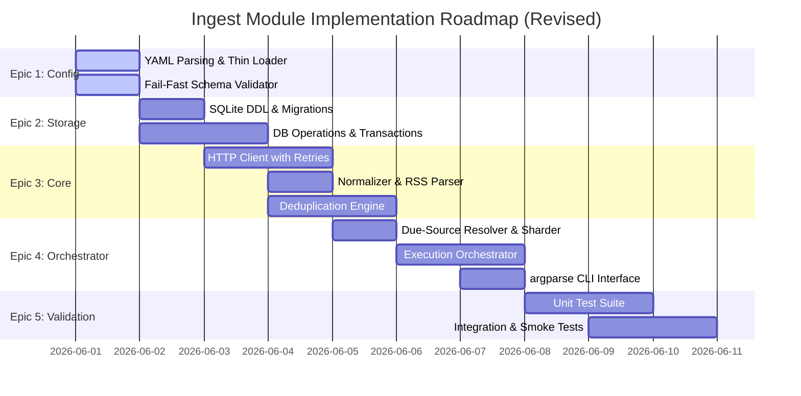

# Ingest Module Implementation Plan

**Document version:** v1.1  
**Status:** Approved for Implementation (Revised)  
**Target Module:** `modules/ingest/`

---

## 1. Executive Summary

This implementation plan outlines the development path for the **Ingest Module**, which is the first pipeline component in the modular UAP/UFO aggregation system. 

```text
[Feed Sources] -> ingest -> canonical database -> classify -> review -> publish -> site
```

The plan focuses on clean architecture, deterministic deduplication, robust HTTP fetching with failure isolation, strict SQLite persistence conformant to `STORAGE_SCHEMA.md` (v1.0), and a robust, repeatable CLI interface. Development is structured into **5 Epics**, **13 Stories**, and **corresponding Tasks** to facilitate incremental delivery, precise tracking, and thorough testing.

---

## 2. Epics, Stories, and Tasks Breakdown



### Epic 1: Config Management & Schema Validation
*Objective: Load sources and categories configuration and enforce strict structural integrity before run initialization.*

#### Story 1.1: Configuration Loader
- **Goal:** Implement clean loaders for `sources.yaml` and `categories.yaml`.
- **Tasks:**
  - [x] **Task 1.1.1:** Setup project python layout (`modules/ingest/src/`, `modules/ingest/tests/`).
  - [x] **Task 1.1.2:** Implement YAML file parser using `PyYAML` supporting environment-independent relative paths.
  - [x] **Task 1.1.3:** Create **thin and lightweight** Python dataclasses representing `SourceConfig` and `CategoryConfig`. *Avoid over-engineering thick model or service layers; keep configuration data access clean and simple.*

#### Story 1.2: Fail-Fast Schema Validator
- **Goal:** Implement schema validation rule checks defined in `SOURCE_CONFIG_SCHEMA.md` to prevent corrupted state ingestion.
- **Tasks:**
  - [x] **Task 1.2.1:** Code fail-fast rules (duplicate `id`, malformed `xml_url`, missing `category_id`, out-of-range `fetch_group`, unknown `schedule_class`, invalid types).
  - [x] **Task 1.2.2:** Code warnings (duplicate `xml_url`, missing `html_url`, empty `title`).
  - [x] **Task 1.2.3:** Expose simple verification API `validate_config()` for the CLI.

---

### Epic 2: Storage Foundation
*Objective: Establish concrete, implementable SQLite database schemas and thread-safe data operations adhering strictly to `STORAGE_SCHEMA.md`.*

#### Story 2.1: SQLite Migration & Connection Setup
- **Goal:** Initialize and manage the local database schema lifecycle.
- **Tasks:**
  - [x] **Task 2.1.1:** Setup **per-operation SQLite connection management** (using connection factories). *Do not introduce an unnecessary database connection pool; SQLite runs locally and is best managed with clean connection creation and disposal per fetch task.*
  - [x] **Task 2.1.2:** Write a schema runner applying DDL scripts (e.g. `v001_initial_ingest_tables.sql`) containing correct column types and indices. Explicitly enforce session-scoped `PRAGMA foreign_keys = ON;` on every connection.
  - [x] **Task 2.1.3:** Support UTC ISO-8601 string conversions (`YYYY-MM-DDTHH:MM:SSZ`) natively in DB adapters.
  - [x] **Task 2.1.4:** Create a simple `schema_migrations` tracking table to log run DDL history, providing metadata for migrations and tracking.

#### Story 2.2: Repository Layer & Transaction Boundaries
- **Goal:** Create clean, transactional interfaces for persistence.
- **Tasks:**
  - [x] **Task 2.2.1:** Implement transaction wrapper ensuring `BEGIN IMMEDIATE TRANSACTION;` for atomic source fetches.
  - [x] **Task 2.2.2:** Develop `SourceStateRepository` to upsert and query source state metrics.
  - [x] **Task 2.2.3:** Develop `FetchRunRepository` and `FetchAttemptRepository` to audit execution logs.
  - [x] **Task 2.2.4:** Develop `SourceItemRepository` and `DedupMarkerRepository` for writing immutable normalized articles.

---

### Epic 3: Core Fetching, Normalization & Deduplication
*Objective: Fetch remote RSS feeds reliably with HTTP caching and retry mechanics, normalize inputs, and deduplicate entries deterministically.*

#### Story 3.1: Robust HTTP Fetcher
- **Goal:** Build an resilient, asynchronous/concurrency-bounded HTTP client with cache awareness.
- **Tasks:**
  - [x] **Task 3.1.1:** Set default timeouts, connection pooling, and bounded concurrency (using `asyncio.Semaphore` with a conservative default limit of 5).
  - [x] **Task 3.1.2:** Implement ETag and Last-Modified caching flow (reading previous validators, sending headers, handling `304 Not Modified` as successful poll with zero new items).
  - [x] **Task 3.1.3:** Implement retries for transient errors (`network_error`, `timeout_error`, `http_error_5xx`) up to 2 attempts with simple backoff; immediately fail on `4xx`.

#### Story 3.2: RSS Feed Parser & Normalizer
- **Goal:** Parse arbitrary XML feeds and transform entries to data contracts.
- **Tasks:**
  - [x] **Task 3.2.1:** Integrate `feedparser` to parse RSS/Atom.
  - [x] **Task 3.2.2:** Normalize titles (trimming/collapsing whitespace) and canonical URLs (trimming, lowercasing scheme/host, stripping trailing slash/fragments, handling empty URL). *Keep query string normalization conservative conforming to DEDUP_POLICY.md; do not aggressively strip query strings.*
  - [x] **Task 3.2.3:** Normalize published timestamps to UTC ISO-8601 (handling fallback rules for unparseable dates).

#### Story 3.3: Deduplication Engine
- **Goal:** Enforce strict duplicate prevention conforming to `DEDUP_POLICY.md`.
- **Tasks:**
  - [x] **Task 3.3.1:** Implement rule precedence parser yielding deterministic keys with rule prefixes (`guid:`, `url:`, `tp:`, `fh:`).
  - [x] **Task 3.3.2:** Implement cross-source matching logic (URL matches allow cross-source deduplication; GUID/TP/FH are restricted).
  - [x] **Task 3.3.3:** Implement double-insert prevention check matching current runtime entries against database `ingest_dedup_marker` records inside write transactions. *Note: source_item.ingest_dedup_key is not unique; the absolute database-level unique constraint is strictly enforced by ingest_dedup_marker.dedup_key.*

---

### Epic 4: Orchestration & CLI
*Objective: Build the core execution engine to run scheduled feeds in shards, track overall run-level health, and expose clear command-line controls.*

#### Story 4.1: Due-Source Resolver & Sharder
- **Goal:** Select eligible sources for fetching.
- **Tasks:**
  - [x] **Task 4.1.1:** Implement `schedule_class` interval due resolver matching current timestamp against `schedule_class` interval and `last_success_at` (do not invent unneeded cron expression resolvers).
  - [x] **Task 4.1.2:** Filter sources by `enabled=true` and custom run scopes (fetch group shards, explicit IDs, or override flags).

#### Story 4.2: Execution Orchestrator
- **Goal:** Tie the loading, sharding, fetching, parsing, deduping, and persistence phases together while protecting runtime stability.
- **Tasks:**
  - [x] **Task 4.2.1:** Implement run execution cycle (recording `fetch_run` at start, sharding work, invoking core fetcher, and updating ended timestamps). *Architectural decoupling: isolate the orchestration and business rules from the asynchronous fetch client for easier, clean testing.*
  - [x] **Task 4.2.2:** Ensure source failure isolation: a failed source must not fail the run, but increments attempt counts and logs errors.
  - [x] **Task 4.2.3:** Implement source health transitions (3 failures -> `degraded`, 5 failures -> `quarantined` for 24h, success resets counters) defined in `ERROR_POLICY.md`.
  - [x] **Task 4.2.4:** Write the execution summary reporter (attempted, succeeded, failed counts, top error classes, quarantined list).

#### Story 4.3: Command-Line Interface (CLI)
- **Goal:** Expose high-quality command-line control of the ingest pipeline using standard library tools.
- **Tasks:**
  - [x] **Task 4.3.1:** Design subcommands (e.g., `validate`, `fetch`, `show-health`, `migrate`) using **standard library `argparse`** for zero-dependency engineering.
  - [x] **Task 4.3.2:** Implement flags (`--groups`, `--source-ids`, `--force`, `--dry-run`, `--db-path`).
  - [x] **Task 4.3.3:** Implement standardized JSON/text operational output conformant to `OPERATIONS_RUNBOOK.md`.

---

## 3. High-Priority Architecture Decisions & Context

1. **Language & Environment:** **Python 3.12+** is strictly locked to match `TECH_SPEC.md:485`. This allows the use of standard library features (such as `tomllib` and modern typing features). 
2. **Third-Party Dependencies:** Kept minimal to avoid bloat (no ORMs, no Pydantic, no Click). The authorized external packages are:
   - `PyYAML` (configuration parsing)
   - `feedparser` (RSS/Atom extraction)
   - `httpx` (asynchronous feed requests)
3. **Database Path:** The SQLite database will be output by default to `data/canonical.db` at the root of the workspace. This is configurable via the CLI `--db-path` argument and keeps SQLite files outside the version-controlled `modules/` source code.
4. **Concurrency & Client Concurrency Model:** Standardized on `asyncio + httpx` to manage I/O-bound request overhead elegantly. The default maximum parallel request concurrency limit is set conservatively to **5**.
5. **Idempotency Strategy:** Per-source atomic write paths are wrapped in distinct transaction boundaries. The database constraint `ingest_dedup_marker.dedup_key UNIQUE` acts as the definitive hard unique guard preventing double insertions.

---

## 4. Key Questions & Review Requests for USER

All core architectural decisions are finalized based on review recommendations:
* **Python Target:** Locked strictly to **Python 3.12+**.
* **Dependencies:** Locked strictly to `PyYAML`, `feedparser`, `httpx`, and standard library utilities.
* **CLI Engine:** Locked to standard `argparse` to minimize maintenance overhead.
* **Concurrency Model:** Locked to asynchronous `asyncio + httpx` with decoupled orchestrator rules for optimal testability.

---

> [!NOTE]
> This plan has been saved to your local artifacts folder at [implementation_plan.md](file:///C:/Users/user/.gemini/antigravity-cli/brain/23f0762c-4266-4ede-b7e9-53d5bad79f3a/implementation_plan.md). You can refer back to it and track tasks as we proceed.
