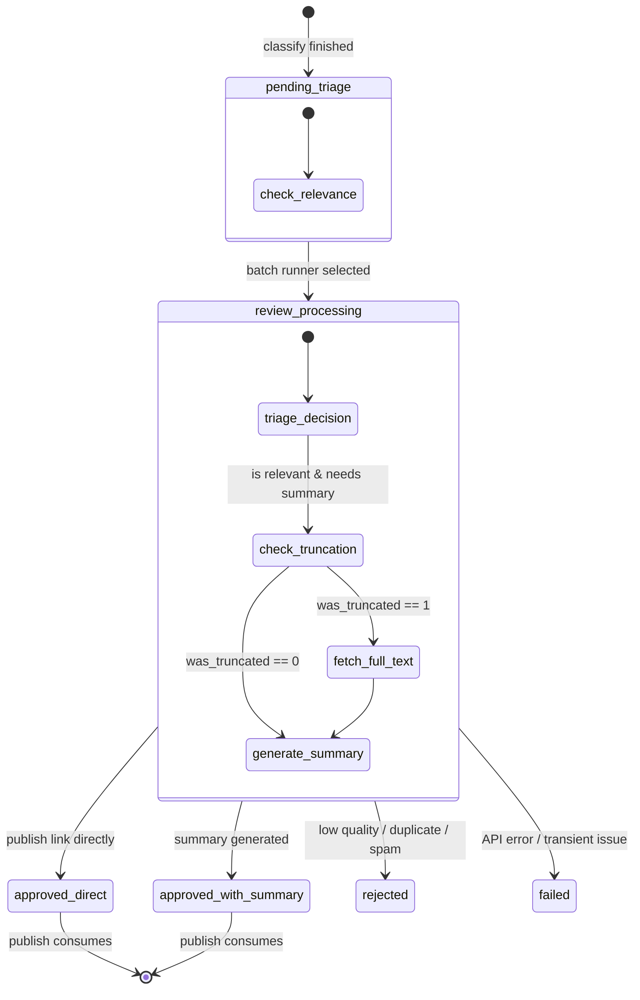

# Technical Document Proposal: Automated Review & Editorial Module (`review`)

**Document version:** v1.0  
**Updated:** 2026-06-15  
**Status:** Architecture Proposal  

---

## 1. Executive Summary

This document proposes the technical design for the **`review`** module. 

Given the large volume of incoming content (currently 4,300+ items in `data/canonical.db` and increasing daily), a pure manual review workflow is unsustainable. This proposal outlines a **fully automated, AI-driven review pipeline** that integrates:
1. **Automated Triage (Relevance & Quality Filter)**: Evaluating classified items (`core` and `adjacent`) to determine if they are fit for publication.
2. **On-Demand Full-Text Reconstruction**: A mechanism to reconstruct the full sanitized text for articles that were truncated during the ingestion phase due to length constraints.
3. **Structured Summary Generation**: Generating high-quality, 3-point structured summaries for long-form articles using LLM APIs.
4. **Hooks for Future Human-in-the-Loop Override**: Designing the database and interface to allow seamless manual editing and override of AI decisions in the future.

---

## 2. Core Architectural Position

The `review` module acts as the automated gatekeeper between the upstream classification and the downstream publishing layer:

```text
[ingest] ──► [classify] ──► [review] (Automated AI Pipeline) ──► [publish] ──► [site]
```

### Module Boundaries
* **Inputs**:
  * `source_item` (metadata, source URL, timestamps)
  * `source_item_text` (sanitized text snippet, `was_truncated` flag)
  * `classification_result` (topic class, descriptive tags)
* **Outputs**:
  * `review_decision` (approval state, rationale, timestamps)
  * `edit_draft` (AI-generated summary, rewritten title, metadata)
* **Boundary Rules**:
  * The `publish` module must strictly query only items with an approved state in the `review_decision` table.
  * `review` must not write to `source_item` or modify raw feed ingestion configurations.

---

## 3. Workflow State Machine

To support automation and future auditability, items transition through the following states controlled by the `review` script:



* **`pending_triage`**: Items classified as `core` or `adjacent` that have not been processed by the review pipeline.
* **`review_processing`**: Active state lock when the automated review runner is evaluating the item.
* **`approved_direct`**: The item is approved for direct publication as a link bookmark (no summary needed).
* **`approved_with_summary`**: The item is approved and a structured summary has been successfully generated.
* **`rejected`**: The item is rejected due to low content density, duplicate content, or irrelevance.
* **`failed`**: The item encountered a transient API or scraper error; eligible for retry.

---

## 4. Full-Text Reconstruction Strategy (Truncation Bypass)

During the `ingest` phase, articles are truncated to `max_length: 12000` (stored in `source_item_text.sanitized_text`) to optimize database storage and default classification costs. 

However, generating a summary from truncated text can lead to incomplete analysis or AI hallucinations. The automated `review` pipeline bypassed this restriction using the following **dynamic reconstruction flow**:

1. **Check Truncation Status**:
   If `source_item_text.was_truncated == 1` and the triage decision determines a summary is required:
2. **Step A: Check Local Cache**:
   Query `source_item_raw.raw_payload` for the current `source_item_id`.
   * If found: Apply the ingest sanitization algorithm on the full raw HTML/payload in memory *without* length constraints, generating the full sanitized working text.
3. **Step B: On-Demand Scrape Fallback**:
   If `source_item_raw` has been deleted (due to retention policies):
   * Run an on-demand HTTP scraper on the article's `canonical_url`.
   * Parse and extract the article text, then sanitize it in memory.
4. **LLM Consumption**:
   Feed the full, reconstructed sanitized text to the summary generation prompt.

### Architectural Benefits:
* Keeps the persistent database lightweight by not storing mega-text payloads permanently.
* Saves bandwidth and scraper overhead by only crawling the full page for the small subset of articles that actually pass classification and require summaries.

---

## 5. Unified AI Triage & Summary API Contract

To optimize API costs and latency, the triage evaluation and summary generation should be executed in a **single LLM request** where possible.

### Proposed System Prompt Outline:
```text
You are an expert UAP/UFO research editor. Your job is to review the following sanitized article text, determine if it is fit for publication on a high-quality aggregation portal, and write a structured summary if necessary.

Triage Rules:
1. Reject clickbait, speculative opinion pieces with no source citations, and duplicate summaries.
2. Direct-approve short announcements or schedules (no summary needed).
3. Approve-with-summary long-form reporting, congressional updates, or scientific papers.

Summary Guidelines (if approved and summary is needed):
- Provide a structured 3-point summary in JSON format:
  1. claim: The primary claim made in the article.
  2. evidence: The level of evidence cited (radar data, official document, video/photo, or eyewitness testimony).
  3. context: Government involvement, key dates, or official responses.
```

### Proposed Output Schema (JSON):
```json
{
  "triage_decision": "approved_with_summary | approved_direct | rejected",
  "rejection_reason": "duplicate | low_quality | opinionated | none",
  "rewritten_title": "A clean, de-sensationalized title",
  "summary": {
    "claim": "A concise description of the main claim (max 60 words).",
    "evidence": "Description of evidence presented, categorized objectively.",
    "context": "Relevant government agency or official committee involvement."
  }
}
```

---

## 6. Proposed Database Schema Changes

To persist the automated review outcomes and allow future UI overrides, we propose the following database tables:

### 6.1 `review_decision`
Durable record of the triage outcome.
* `review_decision_id` (PK, Integer)
* `source_item_id` (FK to `source_item`, Integer, Unique)
* `review_status` (Text, check constraint: `approved_direct`, `approved_with_summary`, `rejected`, `failed`)
* `rejection_reason` (Text, nullable)
* `model_name` (Text, e.g., `gemini-3.5-flash`)
* `reviewed_at` (Timestamp, UTC)

### 6.2 `edit_draft`
Durable record of the generated content (can be overridden by a human in the future).
* `edit_draft_id` (PK, Integer)
* `source_item_id` (FK to `source_item`, Integer, Unique)
* `rewritten_title` (Text, nullable)
* `summary_claim` (Text, nullable)
* `summary_evidence` (Text, nullable)
* `summary_context` (Text, nullable)
* `generation_attempts` (Integer, default 1, used as loop/retry counter)
* `last_rejection_feedback` (Text, nullable, stores reasons for rewrite retries)
* `created_at` (Timestamp, UTC)
* `updated_at` (Timestamp, UTC)

---

## 7. Proposed CLI Interface

The automated pipeline will run via command-line triggers, suitable for cron jobs or automated execution:

### Run Pipeline
Processes pending items in batches.
```bash
python -m modules.review.src.cli run --db-path data/canonical.db --batch-size 30
```

### Dry Run / Preview
Simulates the decisions without writing to the database or calling the LLM (displays prompts).
```bash
python -m modules.review.src.cli run --db-path data/canonical.db --preview --batch-size 5
```

### Status Check
Displays summary statistics of the queue.
```bash
python -m modules.review.src.cli status --db-path data/canonical.db
```
