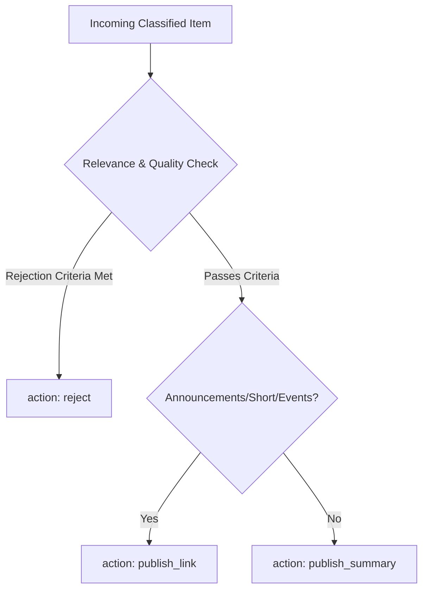

# Review Policy

**Document version:** v1.1  
**Updated:** 2026-06-15  
**Status:** Planning & Active rewrite draft

---

## 1. Purpose

The `review` module acts as the editorial quality gate. Since classification is performed by a broad relevance filter (`core`/`adjacent`), many classified items may still contain noise, duplicates, low content density, or speculative clickbait. 

This document defines the strict editorial policy rules that the automated reviewer (LLM) must follow when evaluating classified items.

---

## 2. Review Criteria

Every item is evaluated against five main criteria to determine its review status and downstream action:

### 2.1 Relevance Validation
* Re-validate the upstream classification. 
* If the upstream module misclassified an item (e.g. general technology news classified as `adjacent`), the reviewer must downgrade the decision to `reject` and set `downstream_action = 'reject'`.

### 2.2 Evidence Density & Quality
* Evaluate the level of evidence claimed. 
* **High Evidence Density:** Items discussing official government documents, congressional transcripts, scientific preprints, radar sensor logs, or official military reports are approved and generally routed to `publish_summary`.
* **Low Evidence Density:** Items discussing unverified social media sightings, loose forum speculations, or anonymous hearsay are rejected.

### 2.3 Tone & Sensationalism
* **Sensationalism Filter:** Reject extreme clickbait, apocalyptic predictions, or articles with highly alarmist or non-neutral tone.
* **Display Title Sanitization:** The reviewer must rewrite the display title to be calm, de-sensationalized, and factual. For example:
  * *Raw Title:* "UFO ALERT!! Pentagon whistleblowers REVEAL terrifying space portal over military base!"
  * *Display Title:* "Pentagon Whistleblower Discloses Alleged Anomalous Event Above Base Location"

### 2.4 Duplicate & Redundancy Check
* While database-level deduplication catches exact matches, different feeds often publish slightly rephrased versions of the same press release.
* The reviewer must reject items that offer zero new information or context beyond already widely published events.

### 2.5 Text Extraction Quality
* Items with corrupted text, dominating paywall blocks ("Subscribe now to read..."), or generic JavaScript warning notifications are rejected or marked as `failed` if a scraping retry is appropriate.

---

## 3. Downstream Routing Rules

The reviewer must choose exactly one of three routing outcomes based on these policies:

### 3.1 `publish_link` (Bookmark Mode)
* **Target:** Announcements of upcoming conferences, congressional schedule changes, brief links to video uploads, or short-form index cards.
* **Action:** Approve. 
* **Required Content:** 
  * A normalized de-sensationalized display title.
  * A short, single-sentence excerpt framing the target URL (persisted under `summary_short`).
  * **Skip bullet points (bullet_1, bullet_2, and bullet_3 MUST be returned as null).**
* **Rationale:** A short sentence excerpt ensures link cards always have consistent editorial framing on the frontend while avoiding the token cost and visual clutter of three bullet points.

### 3.2 `publish_summary` (Full Summary Mode)
* **Target:** In-depth news reports, investigative reporting, legislative bills, official government statements, scientific papers, or transcripts.
* **Action:** Approve. 
* **Required Content:**
  * A normalized de-sensationalized display title.
  * A concise summary paragraph (persisted under `summary_short`).
  * Exactly three structured bullet points detailing:
    1. `claim`: The primary UAP/official claim (persisted under `bullet_1`).
    2. `evidence`: The evidence level cited (persisted under `bullet_2`).
    3. `context`: The official or congressional entities involved (persisted under `bullet_3`).

### 3.3 `reject` (Triage Filter)
* **Target:** Irrelevant items, severe clickbait, general speculative opinion pieces, duplicate news stories, or heavily broken text extractions.
* **Action:** Reject. Persist decision with a clear `decision_reason` (e.g., `'duplicate'`, `'low_quality'`, `'opinionated'`).

---

## 4. Operational Safety Guidelines

* **Neutrality:** The automated reviewer must never adopt a subjective stance on UAP reality. It must evaluate text strictly on whether it presents verifiable evidence, policy developments, or institutional data in a professional tone.
* **No Speculative Excerpts:** When generating the short summary or display title, the reviewer must not include unverified claims as absolute facts; instead, use attribution language (e.g., "The report claims...", "Whistleblowers allege...").
