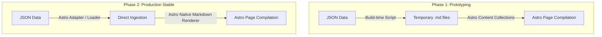

# Design Proposal: Custom Astro `site` Module

This document outlines the evaluation of the reference templates and provides a comprehensive architectural design for the custom `site` module.

Since the downstream handoff is fully defined in the `publish` module (which exports static JSON files to `data/publish_export/`), the `site` module will serve as a **static site generator (SSG)** that reads these JSON files during build time. This ensures 100/100 Lighthouse performance, absolute separation of concerns, and zero security exposure for the canonical database.

---

## 1. Feature Evaluation of Reference Templates

By analyzing the templates in `references/`, we can synthesize their key features into a single, cohesive design:

### 1.1 `astro-sienna` (The Visual & Layout Foundation)
- **Timeline Aesthetic**: Sienna uses a beautiful CSS Grid-based timeline layout. This is highly suitable for chronologically ordered news alerts or RSS feeds. We can display items along a vertical timeline with dots indicating the publishing sequence.
- **Styling Philosophy**: It uses standard CSS variables (`--theme-bg`, `--theme-text`, etc.) for theme toggling (light/dark mode). This aligns with the preference for clean, high-performance vanilla styling rather than heavy utility classes.
- **Micro-animations**: Subtle scale-down and opacity transitions on hover make the interface feel responsive and premium.

### 1.2 `astro-i18n-starter`, `astro-paper-i18n`, & `astroplate-multilingual` (Multilingual Integration)
- **Astro Native i18n**: They leverage Astro's native internationalization features (`astro:i18n`), mapping routes to subdirectories (e.g. `/zh/`, `/en/`, `/ja/`) with a redirect wrapper on the root (`/`).
- **Translation Dictionaries**: They use a simple key-value structure for UI translation strings (e.g., "Read More", "Latest Alerts"). We will implement this to localize UI labels dynamically depending on the current locale path.
- **SEO & Alternate Links**: They automatically inject `<link rel="alternate" hreflang="..." />` meta tags to inform search engines of language variants.

### 1.3 `astro-theme-retypeset` (Prose Aesthetics & Reading Metrics)
- **Typography Focus**: Retypeset is heavily optimized for long-form reading, setting precise leading, font families, and line-widths (`max-width: 60ch`).
- **Estimated Reading Time**: While not explicitly bundled, we can implement a custom, CJK-aware (Chinese, Japanese, Korean) reading time estimator. English averages **200 words per minute**, whereas Chinese/Japanese averages **300-400 characters per minute**. We will compute this dynamically at compile time from the Markdown content body.

### 1.4 `bcms-podcast` (Audio & Playback Controls)
- **Floating Audio Component**: Displays a fixed playback drawer at the bottom of the viewport when an audio file is playing. 
- **Extensibility**: Even if you do not have voice read-aloud files today, we can build a reusable, hidden-by-default `<AudioPlayer>` component. If a post's JSON contains an audio narration link (e.g., `audio_url`), a play button will appear, and the player will float at the bottom when clicked.

---

## 2. Dynamic Architecture & Data Ingestion Flow

Because the `site` module is a downstream consumer of `publish` exports, it does not connect to the SQLite database. Instead, it consumes the static JSON data under `data/publish_export/`. 

To balance rapid UI experimentation, template compatibility, and long-term codebase cleanliness, the ingestion architecture adopts a **phased transition strategy**:

### 2.1 Ingestion Phasing Roadmap



#### Phase 1: Build-Time JSON-to-Markdown Adapter (Active Phase)
During the MVP/verification phase, when visual style changes, SEO field modifications, and template changes are frequent, we prioritize **ease of theme swapping** and **maximum compatibility** with off-the-shelf Astro layouts.
- **Mechanism**: A thin script maps the JSON entries from `data/publish_export/` to temporary `.md` files with matching frontmatter under `src/content/posts/generated/[lang]/[slug].md` prior to the Astro build execution.
- **Guardrails**:
  1. **Single Source of Truth**: The JSON files under `data/publish_export/` remain the sole canonical source. Under no circumstances should the generated `.md` files be edited manually.
  2. **Git Exclusion**: All generated `.md` files must be gitignored (excluded from version control) and treated strictly as build-time outputs.
  3. **Thin Adapter**: The script performing the mapping must only map fields directly (e.g., `display_title` -> `title`), avoiding any complex business logic.

#### Phase 2: Direct JSON Ingestion (Production Target Phase)
Once the UI layout, information architecture, and metadata contracts stabilize, the intermediate `.md` generation step is phased out in favor of direct JSON ingestion.
- **Mechanism**: The site reads JSON items directly at build time using Node.js `fs` module, bypassing temporary file writes.
- **Markdown Rendering**: Content formatting is handled using Astro's native markdown rendering integrations or Astro content loaders (Astro v4+) to maintain absolute style and plug-in consistency, avoiding unsafe direct HTML rendering.

---

## 3. Proposed Folder Structure for `modules/site`

We will follow the canonical module pattern specified in `AGENTS.md`:

```text
modules/site/
├── docs/
│   ├── README.md               # Site module positioning and contracts
│   └── DESIGN_PROPOSAL.md      # Detailed design proposal
├── src/
│   ├── components/
│   │   ├── BaseHead.astro      # Meta tags, SEO, fonts, and hreflang links
│   │   ├── Header.astro        # Header navigation and language picker
│   │   ├── Footer.astro        # Footer metadata and copyright info
│   │   ├── Timeline.astro      # The CSS Grid-based chronological feed
│   │   ├── LanguageSelector.astro # Interactive language picker dropdown
│   │   └── AudioPlayer.astro   # HTML5 narration player (floating drawer)
│   ├── layouts/
│   │   ├── Base.astro          # HTML structure, global CSS styles, theme toggler
│   │   └── Post.astro          # Layout for reading articles
│   ├── content/
│   │   └── posts/
│   │       └── generated/       # Build-time markdown artifacts for Phase 1 only
│   ├── pages/
│   │   ├── [lang]/
│   │   │   ├── index.astro     # Timeline feed page (Chinese, English, Japanese)
│   │   │   ├── posts/
│   │   │   │   └── [slug].astro # Article detailed content page
│   │   │   └── archives/
│   │   │       ├── index.astro # List of months available (from archives/index.json)
│   │   │       └── [month].astro # Monthly posts list
│   │   ├── index.astro         # Root index - handles auto-redirect to default language
│   │   └── stats.astro         # Global aggregate statistics page
│   ├── utils/
│   │   ├── i18n.ts             # UI Translation translation helper
│   │   └── readingTime.ts      # CJK + English reading time estimator helper
│   └── styles/
│       └── global.css          # Theme CSS variables, fonts, reset, and base rules
├── package.json                # Module dependencies (Astro, TypeScript)
└── astro.config.mjs            # Astro config (defines locales and build target)
```

---

## 4. Draft Implementations of Core Components

To demonstrate feasibility, here are draft implementations of the key features:

### 4.1 CJK-Aware Reading Time Estimator (`src/utils/readingTime.ts`)
This helper calculates reading time based on language density:

```typescript
/**
 * Calculates estimated reading time for CJK and English mixed content.
 * English WPM (Words Per Minute): 200
 * CJK CPM (Characters Per Minute): 300
 */
export function calculateReadingTime(content: string, lang: string): number {
  // Strip Markdown markers
  const cleanText = content.replace(/[#*`_\[\]()\-]/g, "");

  if (lang === "zh" || lang === "ja") {
    const cjkChars = cleanText.replace(/\s+/g, "").length;
    return Math.max(1, Math.ceil(cjkChars / 300));
  } else {
    const words = cleanText.trim().split(/\s+/).length;
    return Math.max(1, Math.ceil(words / 200));
  }
}
```

### 4.2 Astro Native i18n Config (`astro.config.mjs`)
Configures Astro's official routing mechanism matching your published languages:

```javascript
import { defineConfig } from "astro/config";

export default defineConfig({
  site: "https://your-uap-disclosure-site.com",
  i18n: {
    defaultLocale: "zh", // Set Traditional Chinese as default
    locales: ["zh", "en", "ja"],
    routing: {
      prefixDefaultLocale: true, // Output is /zh/, /en/, /ja/
      redirectToDefaultLocale: true, // Redirect / to /zh/
    }
  },
  output: "static", // SSG build
});
```

### 4.3 Interactive Language Selector (`src/components/LanguageSelector.astro`)
Reads localized versions and shifts the URL route dynamically:

```astro
---
import { getLocalePaths } from "../utils/i18n";
const currentUrl = Astro.url;
const paths = getLocalePaths(currentUrl);

const labels = {
  zh: "繁體中文",
  en: "English",
  ja: "日本語",
};
---

<div class="lang-selector">
  <select onchange="window.location.href = this.value">
    {paths.map(({ lang, path }) => (
      <option value={path} selected={Astro.currentLocale === lang}>
        {labels[lang]}
      </option>
    ))}
  </select>
</div>

<style>
  .lang-selector select {
    background-color: hsl(var(--theme-bg));
    color: hsl(var(--theme-text));
    border: 1px solid var(--hairline);
    border-radius: 4px;
    padding: 4px 8px;
    font-family: var(--font-sans);
    font-size: 13.5px;
    cursor: pointer;
    transition: border-color 0.2s ease;
  }
  .lang-selector select:hover {
    border-color: hsl(var(--theme-accent));
  }
</style>
```

### 4.4 Narrator Audio Player Component (`src/components/AudioPlayer.astro`)
This drawer resides in the site layout footer, activating dynamically if an `audioUrl` is present:

```astro
---
interface Props {
  audioUrl?: string;
  title?: string;
}
const { audioUrl, title } = Astro.props;
---

{audioUrl && (
  <div id="audio-bar" class="audio-bar">
    <div class="audio-content">
      <span class="audio-title">🎧 Narration: {title}</span>
      <audio controls src={audioUrl} class="audio-element"></audio>
    </div>
  </div>
)}

<style>
  .audio-bar {
    position: fixed;
    bottom: 0;
    left: 0;
    width: 100%;
    background-color: var(--paper);
    border-top: 1px solid var(--hairline);
    padding: 12px 24px;
    z-index: 100;
    box-shadow: 0 -4px 12px rgba(0, 0, 0, 0.05);
  }
  .audio-content {
    max-width: 760px;
    margin: 0 auto;
    display: flex;
    align-items: center;
    justify-content: space-between;
    gap: 16px;
  }
  .audio-title {
    font-family: var(--font-sans);
    font-size: 14px;
    color: hsl(var(--theme-text-muted));
    font-weight: 500;
    white-space: nowrap;
    overflow: hidden;
    text-overflow: ellipsis;
  }
  .audio-element {
    height: 36px;
    max-width: 400px;
    flex-grow: 1;
  }
</style>
```

---

## 5. Summary of Curation & Source Metadata Integration

For each article loaded from `data/publish_export/<lang>/items/<slug>.json`, our layouts will display:
1. **Source Attribution**: Display the `canonical_url` clearly under the title (e.g., "Original Source").
2. **AI Disclosure Note**: Display `disclosure_note` prominently (e.g. `"This item is AI-assisted and human-curated."` or `"This item is AI-generated."`) based on the data populated by `publish`.
3. **Reading Metrics**: Show the calculated reading time (e.g., `5 min read`) alongside the publishing timestamp (`source_published_at`).
4. **Time & Date Layout**: Format timestamps with high-precision absolute time indicators (e.g., `"Jun 24, 2026, 18:42"` in local timezone) to enhance the news alert aesthetic. The site will utilize standard `<time datetime="...">` tags for precise search engine parsing, while rendering build-time localized minute-precision absolute displays for readers to prevent hydration drift. (See [BUILD_AND_ROUTING_POLICY.md](./BUILD_AND_ROUTING_POLICY.md) for execution details).

---

## 6. Design Sampling and Integration Guide

This guide establishes the concrete rules for borrowing code, logic, and layout features from the reference templates under `references/`. To prevent visual incohesion ("Frankenstein UI") and technical conflict, the implementation must adhere to a strict **"One Core Theme + Auxiliary Engineering References"** rule.

### 6.1 Sampling Strategy Matrix

| Reference Template | Sampling Strategy | What to Borrow | What to Exclude |
| :--- | :--- | :--- | :--- |
| **`astro-sienna`** | **Visual & Layout Core** | Spacing system, Typography tokens, CSS variables, Light/Dark mode transitions, CSS-Grid timeline timeline layout. | Default markdown mock data. |
| **`astro-i18n-starter` / `astro-paper-i18n` / `astroplate-multilingual`** | **Engineering & Routing Reference Only** | `astro:i18n` configuration patterns, page directory routing hierarchy, alternate sitemap tags, dynamic `getLocalePaths` helper logic. | Visual UI components, header layouts, spacing styles, card/list layouts. |
| **`astro-theme-retypeset`** | **Prose Typography Reference Only** | Article detail layout limits (`max-width: 64ch`), line-height rhythm, blockquote styling. | Default font faces, navigation UI elements. |
| **`bcms-podcast`** | **Conceptual Audio Reference Only** | Extensible metadata properties (e.g. `audio_url`), basic play controls layout. | Complex React context, Tailwind-heavy player styles, custom image rendering loaders. |

### 6.2 Key Integration Guidelines

#### 1. Maintain Spacing and Variable Cohesion
All components created for the `site` module (e.g. `LanguageSelector`, `Timeline`, `AudioPlayer`) must inherit spacing, borders, and colors exclusively from the CSS variables defined in `src/styles/global.css` (initially sourced from `astro-sienna`). Hardcoded hex values or conflicting spacing tokens (e.g. ad-hoc Tailwind margin offsets) must be avoided.

#### 2. Keep the Ingestion Layer Decoupled
UI components must be independent of how the data is loaded. The data loading adapter (e.g., build-time JSON to markdown generator in Phase 1) must output clean, normalized data fields. Components consume these standard data fields, ensuring that transitioning from Phase 1 to Phase 2 does not require rewriting UI layout layouts.

#### 3. Standardize Markdown Rendering
Do not use raw marked injections inside custom theme structures. Rely on Astro's native markdown styles (specifically `prose` style wrappers configured via CSS variables) to render markdown content, ensuring that plugins (syntax highlighting, TOC, external link behaviors) behave identically across the website.

#### 4. Postpone Visual Narration Player Styling
For the MVP, only the basic data contract (checking for `audio_url`) and a highly simplified, Sienna-styled audio tag element are integrated. A heavy custom media controls drawer will not be implemented until full audio read-aloud files are actively generated by upstream pipeline stages.

