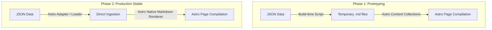

# Design Proposal: Custom Astro `site` Module

This document outlines the evaluation of the reference templates and provides a comprehensive architectural design for the custom `site` module.

Since the downstream handoff is fully defined in the `publish` module (which exports static JSON files to `data/publish_export/`), the `site` module will serve as a **static site generator (SSG)**. In the active MVP phase (Phase 1), a build-time script reads these JSON files to generate temporary Markdown files parsed via Content Collections; in Phase 2, Astro will ingest the JSON files directly. In both phases, the canonical source remains the `publish_export` JSON files. This ensures 100/100 Lighthouse performance, absolute separation of concerns, and zero security exposure for the canonical database.

---

## 1. Feature Evaluation of Reference Templates

By analyzing the templates in `references/`, we can synthesize their key features into a single, cohesive design:

### 1.1 `astro-sienna` (The Visual & Layout Foundation)
- **Timeline Aesthetic**: Sienna uses a beautiful CSS Grid-based timeline layout. This is highly suitable for chronologically ordered news alerts or RSS feeds. We can display items along a vertical timeline with dots indicating the publishing sequence.
- **Styling Philosophy**: It uses Tailwind CSS (v3) for utility class styling alongside CSS variables (`--theme-bg`, `--theme-text`, etc.) for theme toggling (light/dark mode).
- **MVP Styling Choice**: To accelerate MVP prototyping, maximize layout fidelity, and leverage AI code generation efficiency, we adopt Tailwind CSS v3 for the MVP. However, to ensure long-term maintainability, the styling is designed such that we can refactor and peel Tailwind utility classes back to pure Vanilla CSS variables in a post-MVP phase.
- **Micro-animations**: Subtle scale-down and opacity transitions on hover make the interface feel responsive and premium.

### 1.2 `astro-i18n-starter` & `astro-paper-i18n` (Multilingual Integration)
- **Astro Native i18n**: They leverage Astro's native internationalization features (`astro:i18n`), mapping routes to stable locale-key subdirectories (e.g. `/zh/`, `/en/`, `/ja/`) with a redirect wrapper on the root (`/`). Locale keys remain aligned with the `publish_export` directory contract, while richer BCP-47 tags are stored separately in locale metadata.
- **Translation Dictionaries**: They use a simple key-value structure for UI translation strings. We will implement this to localize UI labels dynamically depending on the current locale path.
- **Unit Testing**: `astro-paper-i18n` is the only reference template with real unit tests for its translation and path helper functions. We adopt this testing strategy for our `site` module.
- **SEO & Alternate Links**: They automatically inject `<link rel="alternate" hreflang="..." />` meta tags to inform search engines of language variants.

### 1.3 `astro-theme-retypeset` (Prose Typography & Metrics)
- **Typography Focus**: Retypeset is heavily optimized for long-form reading, setting precise leading, font families, and line-widths (`max-width: 64ch`). We borrow these spacing constraints and typography rhythms.
- **Estimated Reading Time**: Standard templates rely on NPM packages like `reading-time`, which only count whitespace-separated words. This fails for CJK languages (Chinese, Japanese, Korean) which do not use word spaces. We will implement a custom, CJK-aware reading time estimator.

### 1.4 Dropped References
- **`astroplate-multilingual`**: Dropped. This template contains a race condition bug during build-phase dynamic import resolution and its reading-time tool does not support CJK.
- **`bcms-podcast`**: Dropped. It is heavily coupled to a commercial headless CMS and React state machinery. The audio narration feature is nice-to-have but is postponed/dropped for the MVP to keep the system lightweight.

---

## 2. Dynamic Architecture & Data Ingestion Flow

Because the `site` module is a downstream consumer of `publish` exports, it does not connect to the SQLite database. Instead, it consumes the static JSON data under `data/publish_export/`. 

To balance rapid UI experimentation, template compatibility, and long-term codebase cleanliness, the ingestion architecture adopts a **phased transition strategy**:

### 2.1 Ingestion Phasing Roadmap



#### Phase 1: Build-Time JSON-to-Markdown Adapter (Active Phase)
During the MVP/verification phase, when visual style changes, SEO field modifications, and template changes are frequent, we prioritize **ease of theme swapping** and **maximum compatibility** with off-the-shelf Astro layouts.
- **Mechanism**: A thin script maps the JSON entries from `data/publish_export/` to temporary `.md` files with matching frontmatter under `src/content/posts/generated/[lang]/[slug].md` prior to the Astro build execution.
- **Guardrails**:
  1. **Single Source of Truth**: The JSON files under `data/publish_export/` remain the sole canonical source. Under no circumstances should the generated `.md` files be edited manually.
  2. **Git Exclusion**: All generated `.md` files must be gitignored (excluded from version control) and treated strictly as build-time outputs.
  3. **Thin Adapter**: The script performing the mapping must only map fields directly (e.g., `display_title` -> `title`), avoiding any complex business logic.

#### Phase 2: Direct JSON Ingestion (Production Target Phase)
Once the UI layout, information architecture, and metadata contracts stabilize, the intermediate `.md` generation step is phased out in favor of direct JSON ingestion.
- **Mechanism**: The site reads JSON items directly at build time using Node.js `fs` module, bypassing temporary file writes.
- **Markdown Rendering**: Content formatting is handled using Astro's native markdown rendering integrations or Astro content loaders (Astro v4+) to maintain absolute style and plug-in consistency, avoiding unsafe direct HTML rendering.

---

## 3. Proposed Folder Structure for `modules/site`

We will follow the canonical module pattern specified in `AGENTS.md`:

```text
modules/site/
├── docs/
│   ├── README.md               # Site module positioning and contracts
│   └── DESIGN_PROPOSAL.md      # Detailed design proposal
├── src/
│   ├── components/
│   │   ├── BaseHead.astro      # Meta tags, SEO, fonts, and hreflang links
│   │   ├── Header.astro        # Header navigation and language picker
│   │   ├── Footer.astro        # Footer metadata and copyright info
│   │   ├── Timeline.astro      # The CSS Grid-based chronological feed
│   │   └── LanguageSelector.astro # Interactive language picker dropdown
│   ├── layouts/
│   │   ├── Base.astro          # HTML structure, global CSS styles, theme toggler
│   │   └── Post.astro          # Layout for reading articles
│   ├── content/
│   │   └── posts/
│   │       └── generated/       # Build-time markdown artifacts for Phase 1 only
│   ├── pages/
│   │   ├── [lang]/
│   │   │   ├── index.astro     # Timeline feed page (Traditional Chinese, English, Japanese)
│   │   │   ├── posts/
│   │   │   │   └── [slug].astro # Article detailed content page
│   │   │   └── archives/
│   │   │       ├── index.astro # List of months available (from archives/index.json)
│   │   │       └── [month].astro # Monthly posts list
│   │   ├── index.astro         # Root index - handles auto-redirect to default language
│   │   └── stats.astro         # Global aggregate statistics page
│   ├── utils/
│   │   ├── i18n.ts             # UI Translation translation helper
│   │   └── readingTime.ts      # CJK + English reading time estimator helper
│   └── styles/
│       └── global.css          # Theme CSS variables, fonts, reset, and base rules
├── tests/
│   ├── i18n.test.ts            # Unit tests for the i18n helpers
│   └── readingTime.test.ts     # Unit tests for the CJK reading estimator
├── package.json                # Module dependencies (Astro, Tailwind, Vitest, TypeScript)
├── tailwind.config.ts          # Tailwind CSS v3 configuration
└── astro.config.ts             # Astro config (defines locales, Tailwind integration)
```

---

## 4. Draft Implementations of Core Components

To demonstrate feasibility, here are draft implementations of the key features:

### 4.1 CJK-Aware Reading Time Estimator (`src/utils/readingTime.ts`)
This helper calculates reading time based on mixed-language character/word counts:

```typescript
/**
 * Calculates estimated reading time for CJK and Latin mixed content.
 * Latin WPM (Words Per Minute): 200
 * CJK CPM (Characters Per Minute): 300
 */
export function calculateReadingTime(content: string): number {
  // Strip HTML tags and markdown punctuation
  const cleanText = content
    .replace(/<[^>]*>/g, "")
    .replace(/[#*`_\[\]()\-!?,.;:"']/g, " ");

  // Match CJK characters (Han, Hiragana, Katakana)
  const cjkRegex = /[\u3040-\u30ff\u3400-\u4dbf\u4e00-\u9fff\uf900-\ufaff\uff66-\uff9f]/g;
  const cjkMatches = cleanText.match(cjkRegex);
  const cjkCount = cjkMatches ? cjkMatches.length : 0;

  // Strip CJK characters to count remaining Latin words
  const nonCjkText = cleanText.replace(cjkRegex, " ");
  const words = nonCjkText.trim().split(/\s+/).filter(Boolean);
  const wordCount = words.length;

  // Sum the reading time for both scripts
  const readingTime = (cjkCount / 300) + (wordCount / 200);

  return Math.max(1, Math.ceil(readingTime));
}
```

### 4.2 Astro Native i18n Config (`astro.config.ts`)
Configures Astro's official routing mechanism matching your published languages and Tailwind integration:

```typescript
import { defineConfig } from "astro/config";
import tailwind from "@astrojs/tailwind";

export default defineConfig({
  site: "https://your-uap-disclosure-site.com",
  i18n: {
    defaultLocale: "zh", // Stable locale key matching publish_export/<language_code>/
    locales: ["zh", "en", "ja"],
    routing: {
      prefixDefaultLocale: true, // Output is /zh/, /en/, /ja/
      redirectToDefaultLocale: true, // Redirect / to /zh/
    }
  },
  integrations: [
    tailwind({
      applyBaseStyles: false, // Prevent Tailwind from overriding global variables
    }),
  ],
  output: "static", // SSG build
});
```

Separately, the site keeps richer locale metadata in a dedicated i18n config layer, for
example:

```typescript
export const localeProfiles = {
  zh: { label: "繁體中文", langTag: "zh-Hant", dir: "ltr" },
  en: { label: "English", langTag: "en-US", dir: "ltr" },
  ja: { label: "日本語", langTag: "ja-JP", dir: "ltr" },
} as const;
```

This separation preserves compatibility with the current `publish_export/zh/...`
directory contract while still allowing correct `<html lang>`, `hreflang`, and
`Intl.DateTimeFormat` behavior.

### 4.3 Interactive Language Selector (`src/components/LanguageSelector.astro`)
Reads localized versions and shifts the URL route dynamically:

```astro
---
import { getLocalePaths, getLocaleLabels } from "../utils/i18n";
const currentUrl = Astro.url;
const paths = getLocalePaths(currentUrl);
const labels = getLocaleLabels(); // Reads from the dedicated localeProfiles config
---

<div class="lang-selector">
  <select onchange="window.location.href = this.value" class="bg-theme-bg text-theme-text border border-hairline rounded px-2 py-1 font-sans text-sm cursor-pointer hover:border-theme-accent transition-colors duration-200">
    {paths.map(({ lang, path }) => (
      <option value={path} selected={Astro.currentLocale === lang}>
        {labels[lang] || lang}
      </option>
    ))}
  </select>
</div>
```

---

## 5. Summary of Curation & Source Metadata Integration

For each article (loaded from `data/publish_export/<lang>/items/<slug>.json` by the adapter script and compiled as a temporary Markdown file for Astro Content Collections in Phase 1), our layouts will display:
1. **Source Attribution**: Display the `canonical_url` clearly under the title (e.g., "Original Source").
2. **AI Disclosure Note**: Display `disclosure_note` prominently based on the data populated by `publish`.
3. **Reading Metrics**: Show the calculated reading time alongside the publishing timestamp (`source_published_at`).
4. **Time & Date Layout**: Format timestamps with high-precision absolute time indicators (e.g., `"Jun 24, 2026, 18:42"` in local timezone) using `<time datetime="...">` tags.
5. **Data Integrity Validation**: The site build process must perform structural validation on all ingested JSON files. If a file is malformed, missing required fields (e.g., `display_title`, `slug`), or contains incomplete translations, the build must fail immediately and clearly rather than outputting guessed UI states.

---

## 6. Design Sampling and Integration Guide

### 6.1 Sampling Strategy Matrix

| Reference Template | Sampling Strategy | What to Borrow | What to Exclude |
| :--- | :--- | :--- | :--- |
| **`astro-sienna`** | **Visual & Layout Core** | Spacing system, Typography tokens, CSS variables, Light/Dark mode transitions, CSS-Grid timeline layout, Tailwind utility setup. | Default markdown mock data, heavy packages (Partytown, KaTeX, expressive-code). *Note: Option to refactor to vanilla CSS in post-MVP.* |
| **`astro-i18n-starter` / `astro-paper-i18n`** | **Engineering & Routing Reference** | `astro:i18n` configuration patterns, page directory routing hierarchy, alternate sitemap tags, dynamic `getLocalePaths` helper logic, and Vitest testing framework setup. | Visual UI components, header layouts, spacing styles, card/list layouts. |
| **`astro-theme-retypeset`** | **Prose Typography Reference Only** | Article detail layout limits (`max-width: 64ch`), line-height rhythm, blockquote styling. | UnoCSS configuration, custom markdown-it parser, heavy packages. |

### 6.2 Key Integration Guidelines

#### 1. Maintain Spacing and Variable Cohesion
All components created for the `site` module (e.g. `LanguageSelector`, `Timeline`) must inherit spacing, borders, and colors from the design tokens defined in `src/styles/global.css`. Avoid hardcoded colors outside of Tailwind utility classes aligned with our design palette.

#### 2. Keep the Ingestion Layer Decoupled
UI components must remain independent of how data is fetched. In Phase 1, components consume standard data objects from Content Collections (which are generated from the `publish_export` JSON files), ensuring that transitioning to Phase 2 (direct JSON ingestion) does not require rewriting page layouts.

Locale routing keys must also stay decoupled from locale presentation metadata. In the
current contract, `zh`, `en`, and `ja` are stable route/export keys, while values such
as `zh-Hant`, `en-US`, and `ja-JP` belong in locale metadata used for HTML attributes,
SEO, and date formatting.

#### 3. Standardize Markdown Rendering
Rely on Astro's native markdown styles (specifically `prose` style wrappers configured via CSS variables) to render markdown content, ensuring that plugins (syntax highlighting, TOC, external link behaviors) behave identically across the website.

#### 4. Roadmap to Vanilla CSS
The styling system utilizes Tailwind CSS v3 for the initial MVP to maximize speed and template reuse. Class names and custom utility usages should be kept standard to allow straightforward refactoring to a pure Vanilla CSS variable system in subsequent development phases.
